# Intel DDIO Analysis Performance Monitoring

Source PDF: ../docs/intel-ddio-analysis-performance-monitoring.pdf

Converted from PDF with embedded page images and OCR text (22 pages).

## Page Index
- [Page 01](#page-01)
- [Page 02](#page-02)
- [Page 03](#page-03)
- [Page 04](#page-04)
- [Page 05](#page-05)
- [Page 06](#page-06)
- [Page 07](#page-07)
- [Page 08](#page-08)
- [Page 09](#page-09)
- [Page 10](#page-10)
- [Page 11](#page-11)
- [Page 12](#page-12)
- [Page 13](#page-13)
- [Page 14](#page-14)
- [Page 15](#page-15)
- [Page 16](#page-16)
- [Page 17](#page-17)
- [Page 18](#page-18)
- [Page 19](#page-19)
- [Page 20](#page-20)
- [Page 21](#page-21)
- [Page 22](#page-22)

---

## Page 01

### OCR Text

1 Introduction

Intel® Data Direct I/O Technology (Intel® DDIO) is available in current Intel® Xeon® processors. It enables 1/O devices such as network
interface controllers (NICs), disk controllers, and other peripherals to access the CPU's last-level cache (LLC). Direct access to LLC can
drastically increase performance due to lower latencies, CPU utilization, and higher bandwidth.

The Intel® DDIO feature is transparent to software, meaning that software does not need to be modified to utilize it. Since the software is
unaware of Intel® DDIO, how can one determine if and how effectively it is being used, and how can it be optimized to improve 1/0
performance?

This paper details how to use the available set of Intel Performance Monitoring (PerfMon) events and metrics to determine if and how
effectively Intel® DDIO technology is being used. It will cover suggestions on how to improve the utilization of Intel® DDIO.

This paper's content is specific to 4th Generation Intel® Xeon® Scalable Processors (formerly known as Sapphire Rapids) and Sth
Generation Intel® Xeon® Scalable Processors (formerly known as Emerald Rapids); however, many of the concepts apply to previous
Intel® Xeon@ class processor generations.

This paper does not cover the details of how to program uncore PerfMon events; please see the 4"" Gen Intel® Xeon® Scalable Processor
XCC Uncore Perf Guide [1] for this programming information. This paper does not cover cross-socket 1/O
flows; all flows discussed illustrate local traffic on one socket.

The PerfMon events referenced in this paper can be found in JSON format at the Intel® performance monitoring GitHub [2] in the SPR
directory. ~ ~

2 Architecture Background

2.1 4" Generation Intel® Xeon® Scalable Processors Platform Overview

While other documents provide a platform and architecture overview with a similar picture, to establish common ground, we will start with a
high-level overview of the 4th Generation Intel® Xeon® Scalable Processors in the figure below, 4th Generation Intel® Xeon® Scalable
Processors, like previous Intel® Xeon® Scalable Servers, implements a tile layout where various blocks are grouped onto tiles and placed in
Grid vertices. These grid vertices connect to a mesh interconnect, allowing blocks to be interconnected through a common mesh fabric. The
tile layout is SKU-specific; the figure below represents one possible layout or SKU,

https:/Awww.intel.com/content/www/us/en/developer/articles/technical/ddio-analysis-performance-monitoring.html 122

## Page 02

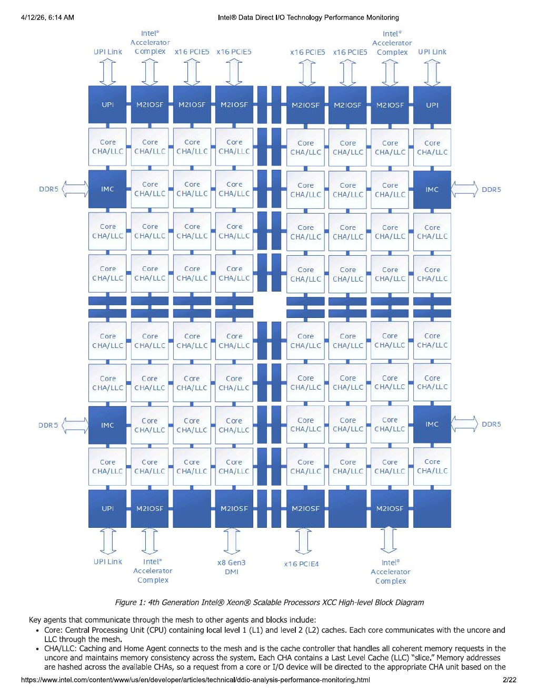

### OCR Text

Inte Intel®
Accelerator Accelerator
UPILink Complex x16PCIES x16 PCIES X1GPCIES x1GPCIE5 Complex UPI Link

core |] LJ core |] core
CHA/LLC[) CHAYLEE PF) CHALE PF) CHAJLLC

I
CHA/LLC |] CHA/LLC |) CHA/LLC |] CHA/LLC

= i = — —1— x
Core Core Core core Core Core
DpRS _ iI I
CHA/LLC FF] CHA/LLC fF] CHA/LLC CHA/LLC |] CHA/LLC | | CHA/LLC
x x x x x x
core |] core Core Core core |} Core Core Core

SHALL) ctajule | VeHartuc | enaytle CHA/LLC |] CHA/LLC |) CHA/LLC[') CHA/LLC

Ce eee ere eae
cHayutc f) cHayicc P} craic fF) cHa/LLc

=

CHA/LLC] | CHA/LLC |] CHA/LLC |] CHA/LLC

Core |] core | Core Core
CHA/LLC |] CHA/LLC |) CHA/LLC[') CHA/LLC

==

Core |} core |} Core |} core
cHasitc FY cHayutc FY cra/iec FY cHayuLc

Core core |] core |} core
cHasute FM) cHayuic Ff cHa/iic FF cHA/LLc

x x x
Core Core Core
CHA/LLC PF) CHA/LLC FF CHA/LLC ORS.
x x x

Core |} core |} core Core
cHasitc  cHayitc FY cHayiic PF) CHALLE

Core |} core |] coe |] core
cHayitcf) crayutc FY} crayiic f} CHA/LLC

x x x
. Core Core Core
coca CHA/LLC PY CHA/LLC f) CHA/LLC
x x x

core |) core |} cae Core
cHayutc PF cHayitc FF} cuayiic f) cHasiic

———

UPI Link Intel® x8 Gen3 X16 PCIEA Intel®
Accelerator DMI Accelerator
Complex Complex

Figure 1: 4th Generation Intel® Xeon® Scalable Processors XCC High-level Block Diagram

Key agents that communicate through the mesh to other agents and blocks include:
«Core: Central Processing Unit (CPU) containing local level 1 (L1) and level 2 (L2) caches. Each core communicates with the uncore and
LLC through the mesh.
+ CHA/LLC: Caching and Home Agent connects to the mesh and is the cache controller that handles all coherent memory requests in the
uncore and maintains memory consistency across the system. Each CHA contains a Last Level Cache (LLC) “slice,” Memory addresses
are hashed across the avallable CHAs, so a request from a core or I/O device will be directed to the appropriate CHA unit based on the

https:/Avww.intel,com/contentiwww/us/en/developer/articles/technical/ddio-analysis-performance-monitoring.html 222

## Page 03

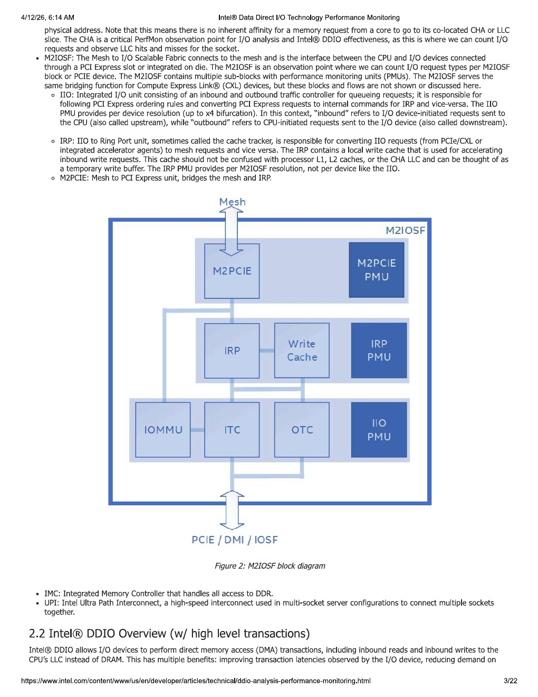

### OCR Text

physical address. Note that this means there is no inherent affinity for a memory request from a core to go to its co-located CHA or LLC
slice. The CHA is a critical PerfMon observation point for I/O analysis and Intel® DDIO effectiveness, as this is where we can count I/O
requests and observe LLC hits and misses for the socket.

+ M2IOSF: The Mesh to 1/O Scalable Fabric connects to the mesh and is the interface between the CPU and I/O devices connected
through a PCI Express slot or integrated on die. The M2IOSF is an observation point where we can count I/O request types per M2IOSF
block or PCIE device. The M2IOSF contains multiple sub-blocks with performance monitoring units (PMUs). The M2IOSF serves the
same bridging function for Compute Express Link® (CXL) devices, but these blocks and flows are not shown or discussed here.

© TIO: Integrated 1/0 unit consisting of an inbound and outbound traffic controller for queueing requests; it is responsible for
following PCI Express ordering rules and converting PCI Express requests to internal commands for IRP and vice-versa. The IO
PMU provides per device resolution (up to x4 bifurcation), In this context, “inbound” refers to I/O device-initiated requests sent to
the CPU (also called upstream), while “outbound” refers to CPU-initiated requests sent to the I/O device (also called downstream).

‘© IRP: IIO to Ring Port unit, sometimes called the cache tracker, is responsible for converting IIO requests (from PCle/CXL or
integrated accelerator agents) to mesh requests and vice versa. The IRP contains a local write cache that is used for accelerating
inbound write requests. This cache should not be confused with processor L1, L2 caches, or the CHA LLC and can be thought of as
a temporary write buffer. The IRP PMU provides per M2IOSF resolution, not per device like the 110.

‘© M2PCIE: Mesh to PCI Express unit, bridges the mesh and IRP.

Mesh

ae

M2PCIE
vie)

M2PCIE

PCIE / DMI / OSE

Figure 2: M2IOSF block diagram

+ IMC: Integrated Memory Controller that handles all access to DDR.
+ UPI: Intel Ultra Path Interconnect, a high-speed interconnect used in multi-socket server configurations to connect multiple sockets
together.

2.2 Intel® DDIO Overview (w/ high level transactions)

Intel® DDIO allows I/O devices to perform direct memory access (DMA) transactions, including inbound reads and inbound writes to the
CPU's LLC instead of DRAM. This has multiple benefits: improving transaction latencies observed by the I/O device, reducing demand on

https:/Avww.intel,com/contentiwww/us/en/developer/articles/technical/ddio-analysis-performance-monitoring.html 3122

## Page 04

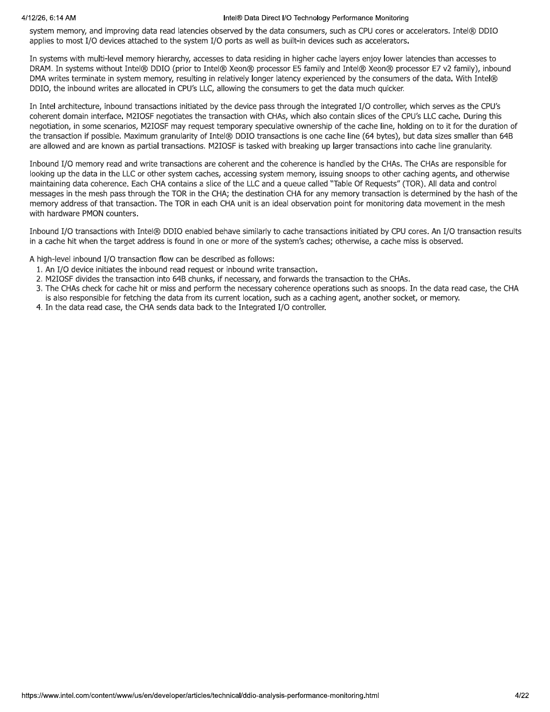

### OCR Text

system memory, and improving data read latencies observed by the data consumers, such as CPU cores or accelerators. Intel® DDIO
applies to most 1/0 devices attached to the system 1/O ports as well as built-in devices such as accelerators,

In systems with multi-level memory hierarchy, accesses to data residing in higher cache layers enjoy lower latencies than accesses to
DRAM. In systems without Intel® DDIO (prior to Intel® Xeon® processor E5 family and Intel® Xeon® processor E7 v2 family), inbound
DMA writes terminate in system memory, resulting in relatively longer latency experienced by the consumers of the data, With Intel®
DDIO, the inbound writes are allocated in CPU's LLC, allowing the consumers to get the data much quicker.

In Intel architecture, inbound transactions initiated by the device pass through the integrated 1/O controller, which serves as the CPU's
coherent domain interface. M2IOSF negotiates the transaction with CHAs, which also contain slices of the CPU's LLC cache, During this
negotiation, in some scenarios, MZIOSF may request temporary speculative ownership of the cache line, holding on to it for the duration of
the transaction if possible. Maximum granularity of Intel® DDIO transactions is one cache line (64 bytes), but data sizes smaller than 64B
are allowed and are known as partial transactions, M2IOSF is tasked with breaking up larger transactions into cache line granularity,

Inbound 1/0 memory read and write transactions are coherent and the coherence is handled by the CHAS. The CHAs are responsible for
looking up the data in the LLC or other system caches, accessing system memory, issuing snoops to other caching agents, and otherwise
maintaining data coherence. Each CHA contains a slice of the LLC and a queue called "Table Of Requests” (TOR). All data and control
messages in the mesh pass through the TOR in the CHA; the destination CHA for any memory transaction is determined by the hash of the
memory address of that transaction. The TOR in each CHA unit is an ideal observation point for monitoring data movement in the mesh
with hardware PMON counters.

Inbound I/O transactions with Intel® DDIO enabled behave similarly to cache transactions initiated by CPU cores. An I/O transaction results
in a cache hit when the target address is found in one or more of the system's caches; otherwise, a cache miss is observed.

A high-level inbound 1/0 transaction flow can be described as follows:
1, An I/O device initiates the inbound read request or inbound write transaction.
2. M2IOSF divides the transaction into 64B chunks, if necessary, and forwards the transaction to the CHAS.
3, The CHAs check for cache hit or miss and perform the necessary coherence operations such as snoops, In the data read case, the CHA
is also responsible for fetching the data from its current location, such as a caching agent, another socket, or memory.
4. In the data read case, the CHA sends data back to the Integrated 1/0 controller.

https:/Awww.intel.com/content/www/us/en/developer/articles/technical/ddio-analysis-performance-monitoring.html 422

## Page 05

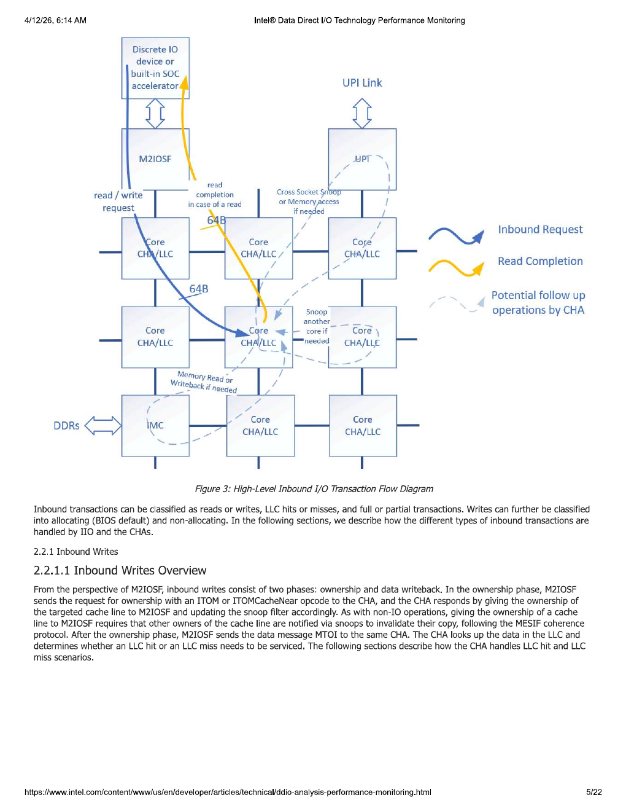

### OCR Text

Discrete lO
device or
built-in SOC :
accelerator Al UPI Link
M2i0sF _ pr >
\ pN
_ read
read / write sonnets Gis sca ar ;
in case of a read or Memoryaccess !
request a reac Reta

3g ya E “N\A Inbound Request

‘ore Core |
CHIYLLC CHA/LLC / 7
7 NA Read Completion
38: X ae Potential follow up
) ¥ Snoop operations by CHA
another
Core Mm Core <q | coreit Core y
CHA/LLC CHA/LLC h [oneeded = CHA/LLE = [
Zz BL eaeeiee
Memory Read or p
weer, |
7 a
( 7
\ L~ Core Core
Bue = ye 7] cHajuc CHA/LLC

Figure 3: High-Level Inbound 1/0 Transaction Flow Diagram

Inbound transactions can be classified as reads or writes, LLC hits or misses, and full or partial transactions. Writes can further be classified
into allocating (BIOS default) and non-allocating. In the following sections, we describe how the different types of inbound transactions are
handled by IIO and the CHAs.

2.2.1 Inbound Writes
2.2.1.1 Inbound Writes Overview

From the perspective of M2I0SF, inbound writes consist of two phases: ownership and data writeback, In the ownership phase, M2IOSF
sends the request for ownership with an ITOM or ITOMCacheNear opcode to the CHA, and the CHA responds by giving the ownership of
the targeted cache line to M2IOSF and updating the snoop filter accordingly. As with non-IO operations, giving the ownership of a cache
line to M2IOSF requires that other owners of the cache line are notified via snoops to invalidate their copy, following the MESIF coherence
protocol. After the ownership phase, M2IOSF sends the data message MTOI to the same CHA. The CHA looks up the data in the LLC and
determines whether an LLC hit or an LLC miss needs to be serviced, The following sections describe how the CHA handles LLC hit and LLC
miss scenarios.

https:/Avww.intel,com/contentiwww/us/en/developer/articles/technical/ddio-analysis-performance-monitoring.html 5122

## Page 06

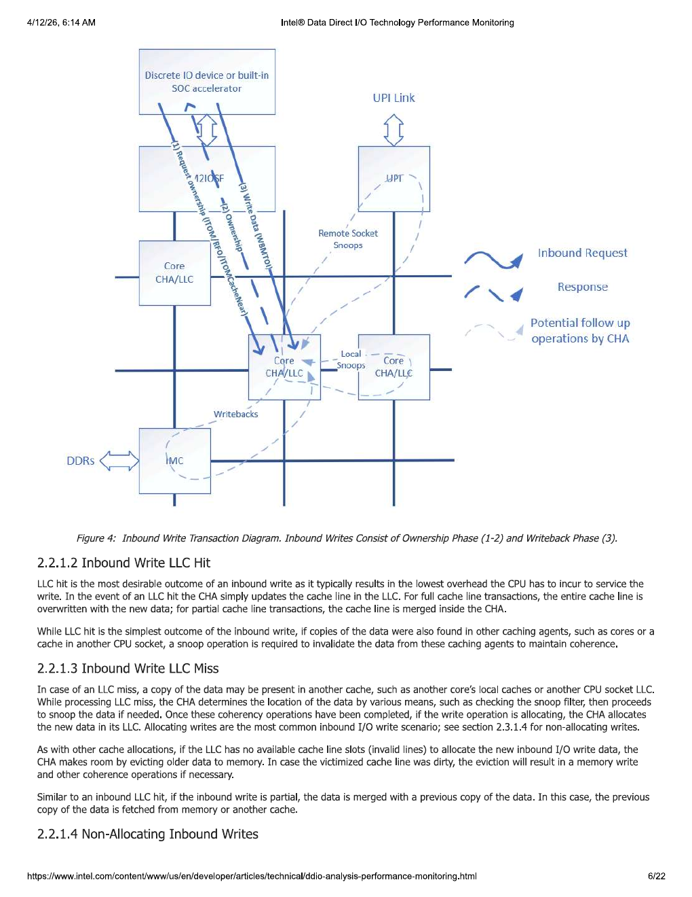

### OCR Text

Discrete IO device or built-in
SOC accelerator

UPI Link
V PN 0

\

4 spr >

we ,
=

4%
44

Remote Socket

3
%
3
244
aS 3 Snoops
3 , Inbound Request
Core A % g o NA

jenie Response
Nd

Potential follow up
operations by CHA

\
y \ ' Local

Core ~e L -snoops
CHAVLLC »

~ Core
CHA/LLE

Writebacks

DDRs i Ie

Figure 4: Inbound Write Transaction Diagram. Inbound Writes Consist of Ownership Phase (1-2) and Writeback Phase (3).

2.2.1.2 Inbound Write LLC Hit

LLC hit is the most desirable outcome of an inbound write as it typically results in the lowest overhead the CPU has to incur to service the
write, In the event of an LLC hit the CHA simply updates the cache line in the LLC. For full cache line transactions, the entire cache line is
overwritten with the new data; for partial cache line transactions, the cache line is merged inside the CHA.

While LLC hit is the simplest outcome of the inbound write, if copies of the data were also found in other caching agents, such as cores or a
cache in another CPU socket, a snoop operation is required to invalidate the data from these caching agents to maintain coherence,
2.2.1.3 Inbound Write LLC Miss

In case of an LLC miss, a copy of the data may be present in another cache, such as another core’s local caches or another CPU socket LLC.
While processing LLC miss, the CHA determines the location of the data by various means, such as checking the snoop filter, then proceeds
to snoop the data if needed. Once these coherency operations have been completed, if the write operation is allocating, the CHA allocates
the new data in its LLC. Allocating writes are the most common inbound I/O write scenario; see section 2.3.1.4 for non-allocating writes.

‘As with other cache allocations, if the LLC has no available cache line slots (invalid lines) to allocate the new inbound 1/O write data, the
CHA makes room by evicting older data to memory. In case the victimized cache line was dirty, the eviction will result in a memory write
and other coherence operations if necessary.

Similar to an inbound LLC hit, if the inbound write is partial, the data is merged with a previous copy of the data. In this case, the previous
copy of the data is fetched from memory or another cache.

2.2.1.4 Non-Allocating Inbound Writes

https:/Avww.intel,com/contentiwww/us/en/developer/articles/technical/ddio-analysis-performance-monitoring.html 6122

## Page 07

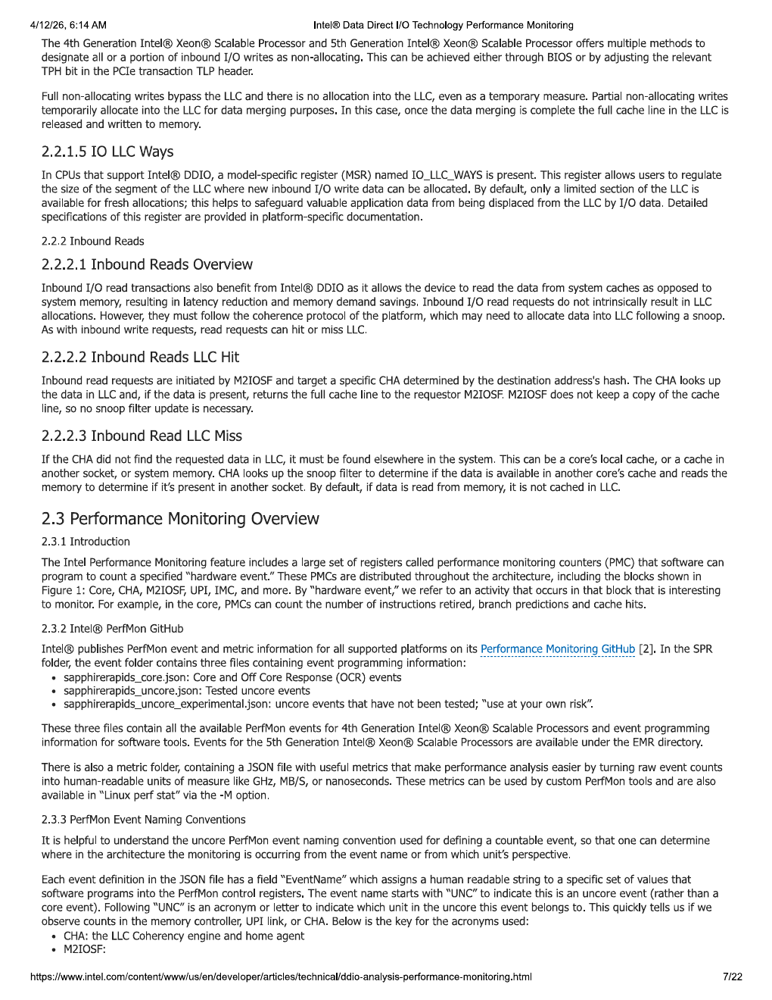

### OCR Text

The 4th Generation Intel® Xeon® Scalable Processor and Sth Generation Intel® Xeon® Scalable Processor offers multiple methods to

designate all or a portion of inbound 1/0 writes as non-allocating, This can be achieved either through BIOS or by adjusting the relevant
‘TPH bit in the PCle transaction TLP header.

Full non-allocating writes bypass the LLC and there is no allocation into the LLC, even as a temporary measure. Partial non-allocating writes
temporarily allocate into the LLC for data merging purposes. In this case, once the data merging is complete the full cache line in the LLC is
released and written to memory.

2.2.1.5 IO LLC Ways

In CPUs that support Intel® DDIO, a model-specific register (MSR) named IO_LLC_WAYS is present. This register allows users to regulate
the size of the segment of the LLC where new inbound 1/0 write data can be allocated, By default, only a limited section of the LLC is
available for fresh allocations; this helps to safeguard valuable application data from being displaced from the LLC by I/O data, Detailed
specifications of this register are provided in platform-specific documentation.

2.2.2 Inbound Reads
2.2.2.1 Inbound Reads Overview

Inbound 1/0 read transactions also benefit from Intel® DDIO as it allows the device to read the data from system caches as opposed to
system memory, resulting in latency reduction and memory demand savings, Inbound 1/0 read requests do not intrinsically result in LLC
allocations. However, they must follow the coherence protocol of the platform, which may need to allocate data into LLC following a snoop.
‘As with inbound write requests, read requests can hit or miss LLC.

2.2.2.2 Inbound Reads LLC Hit

Inbound read requests are initiated by M2IOSF and target a specific CHA determined by the destination address's hash. The CHA looks up
the data in LLC and, if the data is present, returns the full cache line to the requestor M2IOSF. M2IOSF does not keep a copy of the cache
line, so no snoop filter update is necessary.

2.2.2.3 Inbound Read LLC Miss

If the CHA did not find the requested data in LLC, it must be found elsewhere in the system. This can be a core’s local cache, or a cache in
another socket, or system memory. CHA looks up the snoop filter to determine if the data is available in another core’s cache and reads the
memory to determine if it’s present in another socket. By default, if data is read from memory, it is not cached in LLC.

2.3 Performance Monitoring Overview
2.3.1 Introduction

The Intel Performance Monitoring feature includes a large set of registers called performance monitoring counters (PMC) that software can
program to count a specified “hardware event.” These PMCs are distributed throughout the architecture, including the blocks shown in
Figure 1: Core, CHA, M2IOSF, UPI, IMC, and more. By “hardware event,” we refer to an activity that occurs in that block that is interesting
to monitor. For example, in the core, PMCs can count the number of instructions retired, branch predictions and cache hits.

2.3.2 Intel® PerfMon GitHub

Intel® publishes PerfMon event and metric information for all supported platforms on its Performance Monitoring GitHub [2], In the SPR
folder, the event folder contains three files containing event programming information:

+ sapphirerapids_core.json: Core and Off Core Response (OCR) events

+ sapphirerapids_uncore.json: Tested uncore events

+ sapphirerapids_uncore_experimental.json: uncore events that have not been tested; “use at your own risk”.

These three files contain all the available PerfMon events for 4th Generation Intel® Xeon® Scalable Processors and event programming
information for software tools. Events for the 5th Generation Intel® Xeon® Scalable Processors are available under the EMR directory.

There is also a metric folder, containing a JSON file with useful metrics that make performance analysis easier by turning raw event counts
into human-readable units of measure like GHz, MB/S, or nanoseconds. These metrics can be used by custom PerfMon tools and are also
available in “Linux perf stat” via the -M option

2.3.3 PerfMon Event Naming Conventions

It is helpful to understand the uncore PerfMon event naming convention used for defining a countable event, so that one can determine
where in the architecture the monitoring is occurring from the event name or from which unit's perspective,

Each event definition in the JSON file has a field “EventName” which assigns a human readable string to a specific set of values that
software programs into the PerfMon control registers. The event name starts with "UNC" to indicate this is an uncore event (rather than a
core event). Following "UNC" is an acronym or letter to indicate which unit in the uncore this event belongs to. This quickly tells us if we
observe counts in the memory controller, UPI link, or CHA. Below is the key for the acronyms used:

* CHA: the LLC Coherency engine and home agent

+ M2IOSF:

https:/Awww.intel.com/content/www/us/en/developer/articles/technical/ddio-analysis-performance-monitoring.html 7122

## Page 08

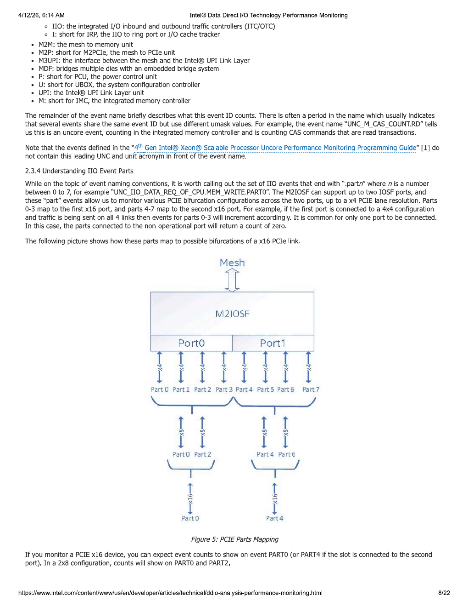

### OCR Text

4112126, 6:14 AM Intel® Data Direct I/O Technology Performance Monitoring
© IO: the integrated 1/0 inbound and outbound traffic controllers (ITC/OTC)
© I: short for IRP, the I1O to ring port or 1/0 cache tracker

M2M: the mesh to memory unit

M2P: short for M2PCIe, the mesh to PCIe unit

MBUPT: the interface between the mesh and the Intel® UPI Link Layer

MDF: bridges multiple dies with an embedded bridge system
short for PCU, the power control unit

U: short for UBOX, the system configuration controller

UPI: the Intel® UPI Link Layer unit

: short for IMC, the integrated memory controller

The remainder of the event name briefly describes what this event ID counts. There is often a period in the name which usually indicates
that several events share the same event ID but use different umask values. For example, the event name “UNC_M_CAS_COUNT.RD” tells
us this is an uncore event, counting in the integrated memory controller and is counting CAS commands that are read transactions.

Note that the events defined in the "4" Gen Intel® Xeon® Scalable Processor Uncore Performance Monitoring Programming Guide” [1] do
not contain this leading UNC and unit acronym in front of

2.3.4 Understanding 110 Event Parts

While on the topic of event naming conventions, it is worth calling out the set of I10 events that end with “.partn’” where nis a number
between 0 to 7, for example “UNC_IIO_DATA_REQ_OF_CPU.MEM_WRITE.PARTO”. The M2IOSF can support up to two IOSF ports, and
these “part” events allow us to monitor various PCIE bifurcation configurations across the two ports, up to a x4 PCIE lane resolution. Parts
0-3 map to the first x16 port, and parts 4-7 map to the second x16 port. For example, if the first port is connected to a 4x4 configuration
and traffic is being sent on all 4 links then events for parts 0-3 will increment accordingly. It is common for only one port to be connected.
In this case, the parts connected to the non-operational port will return a count of zero.

The following picture shows how these parts map to possible bifurcations of a x16 PCTe link.

Mesh

iT

M210SF

Figure 5: PCIE Parts Mapping

If you monitor a PCIE x16 device, you can expect event counts to show on event PARTO (or PARTS if the slot is connected to the second
port). In a 2x8 configuration, counts will show on PARTO and PART2.

https:/Avww.intel,com/contentiwww/us/en/developer/articles/technical/ddio-analysis-performance-monitoring.html 8122

## Page 09

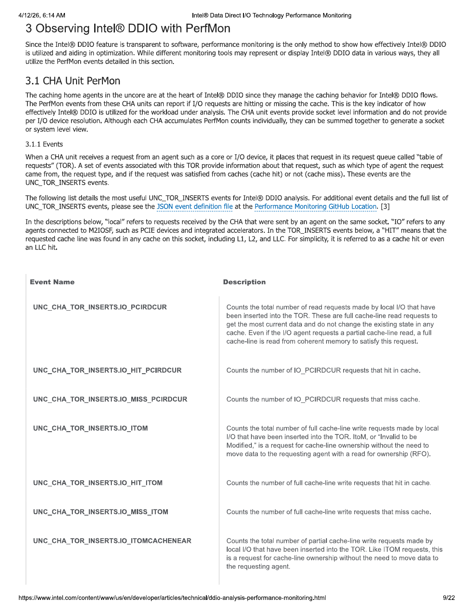

### OCR Text

3 Observing Intel® DDIO with PerfMon

Since the Intel® DDIO feature is transparent to software, performance monitoring is the only method to show how effectively Intel® DDIO
is utilized and aiding in optimization. While different monitoring tools may represent or display Intel® DDIO data in various ways, they all
utilize the PerfMon events detailed in this section.

3.1 CHA Unit PerMon

The caching home agents in the uncore are at the heart of Intel® DDIO since they manage the caching behavior for Intel® DDIO flows.
The PerfMon events from these CHA units can report if I/O requests are hitting or missing the cache. This is the key indicator of how
effectively Intel® DDIO is utilized for the workload under analysis. The CHA unit events provide socket level information and do not provide
per I/O device resolution, Although each CHA accumulates PerfMon counts individually, they can be summed together to generate a socket
or system level view.

3.1.1 Events

When a CHA unit receives a request from an agent such as a core or I/O device, it places that request in its request queue called “table of
requests” (TOR). A set of events associated with this TOR provide information about that request, such as which type of agent the request
came from, the request type, and if the request was satisfied from caches (cache hit) or not (cache miss), These events are the
UNC_TOR_INSERTS events.

The following list details the most useful UNC_TOR_INSERTS events for Intel® DDIO analysis. For additional event details and the full list of
UNC_TOR_INSERTS events, please see the JSON event definition file at the Performance Monitoring GitHub Location. [3]

In the descriptions below, “local” refers to requests received by the CHA that were sent by an agent on the same socket, “IO” refers to any
agents connected to M2IOSF, such as PCIE devices and integrated accelerators. In the TOR_INSERTS events below, a “HIT” means that the
requested cache line was found in any cache on this socket, including L1, L2, and LLC. For simplicity, itis referred to as a cache hit or even
an LLC hit,

Event Name Description

UNC_CHA_TOR_INSERTS.IO_PCIRDCUR Counts the total number of read requests made by local /O that have
been inserted into the TOR. These are full cache-line read requests to
get the most current data and do not change the existing state in any
cache, Even if the I/O agent requests a partial cache-line read, a full
cache-line is read from coherent memory to satisfy this request.

UNC_CHA_TOR_INSERTS.IO_HIT_PCIRDCUR Counts the number of 1O_PCIRDCUR requests that hit in cache.

UNC_CHA_TOR_INSERTS.IO_MISS_PCIRDCUR Counts the number of IO_PCIRDCUR requests that miss cache.

UNC_CHA_TOR_INSERTS.10_ITOM Counts the total number of full cache-line write requests made by local
/O that have been inserted into the TOR. ItoM, or “Invalid to be
Modified,” is a request for cache-line ownership without the need to
move data to the requesting agent with a read for ownership (RFO).

UNC_CHA_TOR_INSERTS.IO_HIT_ITOM. Counts the number of full cache-line write requests that hit in cache.
UNC_CHA_TOR_INSERTS.1O_MISS_ITOM Counts the number of full cache-line write requests that miss cache.
UNC_CHA_TOR_INSERTS.IO_ITOMCACHENEAR Counts the total number of partial cache-line write requests made by

local 1/0 that have been inserted into the TOR. Like ITOM requests, this
is a request for cache-line ownership without the need to move data to
the requesting agent.

https:/Avww.intel,com/contentiwww/us/en/developer/articles/technical/ddio-analysis-performance-monitoring.html 9122

## Page 10

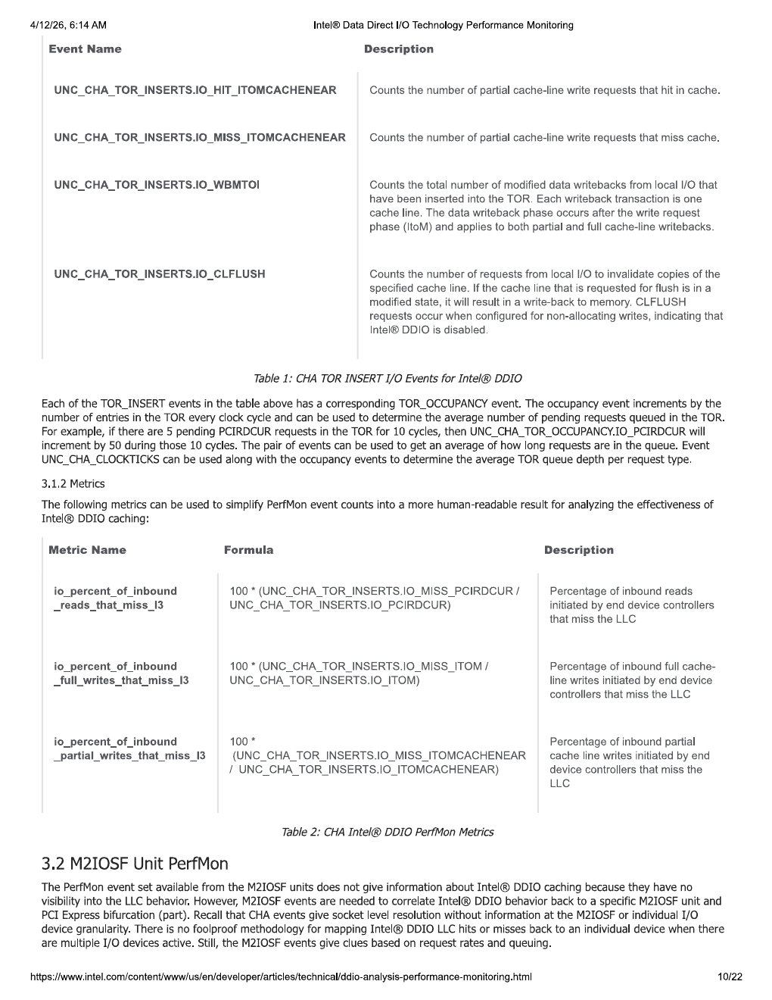

### OCR Text

Event Name Description

UNC_CHA_TOR_INSERTS.IO_HIT_ITOMCACHENEAR Counts the number of partial cache-line write requests that hit in cache,

UNC_CHA_TOR_INSERTS.IO_MISS_ITOMCACHENEAR Counts the number of partial cache-line write requests that miss cache,

UNC_CHA_TOR_INSERTS.IO_WBMTOI Counts the total number of modified data writebacks from local /O that
have been inserted into the TOR. Each writeback transaction is one
cache line. The data writeback phase occurs after the write request
phase (ItoM) and applies to both partial and full cache-line writebacks.

UNC_CHA_TOR_INSERTS.IO_CLFLUSH Counts the number of requests from local I/O to invalidate copies of the
specified cache line. If the cache line that is requested for flush is in a
modified state, it will result in a write-back to memory. CLFLUSH
requests occur when configured for non-allocating writes, indicating that
Intel® DDIO is disabled.

Table 1: CHA TOR INSERT 1/O Events for Intel® DDIO

Each of the TOR_INSERT events in the table above has a corresponding TOR_OCCUPANCY event. The occupancy event increments by the
number of entries in the TOR every clock cycle and can be used to determine the average number of pending requests queued in the TOR.
For example, if there are 5 pending PCIRDCUR requests in the TOR for 10 cycles, then UNC_CHA_TOR_OCCUPANCY.1O_PCIRDCUR will
increment by 50 during those 10 cycles. The pair of events can be used to get an average of how long requests are in the queue. Event
UNC_CHA_CLOCKTICKS can be used along with the occupancy events to determine the average TOR queue depth per request type.

3.1.2 Metrics

The following metrics can be used to simplify PerfMon event counts into a more human-readable result for analyzing the effectiveness of
Intel® DDIO caching:

Metric Name Formula Description
io_percent_of_inbound 100 * (UNC_CHA_TOR_INSERTS.|O_MISS_PCIRDCUR/ —_ Percentage of inbound reads
_feads_that_miss_I3 UNC_CHA_TOR_INSERTS.IO_PCIRDCUR) initiated by end device controllers

that miss the LLC

io_percent_of_inbound 100 * (UNC_CHA_TOR_INSERTS.|O_MISS_ITOM/ Percentage of inbound full cache-
_full_writes_that_miss_I3 UNC_CHA_TOR_INSERTS.IO_ITOM) line writes initiated by end device
controllers that miss the LLC

io_percent_of_inbound 100* Percentage of inbound partial
_Partial_writes_that_miss_13  (UNC_CHA_TOR_INSERTS.IO_MISS_ITOMCACHENEAR _ cache line writes initiated by end
J UNC_CHA_TOR_INSERTS.|O_ITOMCACHENEAR) device controllers that miss the
ule

Table 2: CHA Intel® DDIO PerfMon Metrics

3.2 M2IOSF Unit PerfMon

The PerfMon event set available from the M2IOSF units does not give information about Intel® DDIO caching because they have no
visibility into the LLC behavior, However, M2IOSF events are needed to correlate Intel® DDIO behavior back to a specific M2IOSF unit and
PCI Express bifurcation (part). Recall that CHA events give socket level resolution without information at the M2IOSF or individual 1/O
device granularity. There is no foolproof methodology for mapping Intel® DDIO LLC hits or misses back to an individual device when there
are multiple 1/0 devices active. Still, the M2IOSF events give clues based on request rates and queuing.

https:/Avww.intel,com/content/www/us/en/developer/articles/technical/ddio-analysis-performance-monitoring.html 10122

## Page 11

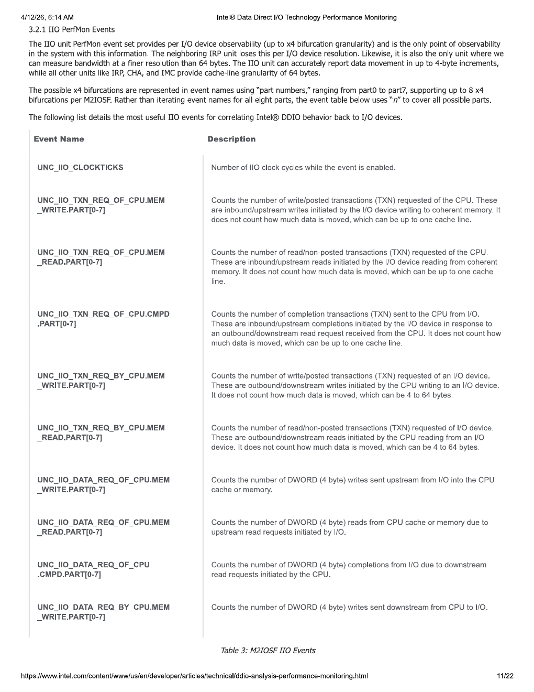

### OCR Text

4112126, 6:14 AM Intel® Data Direct I/O Technology Performance Monitoring
3.2.1 IIO PerfMon Events
The IIO unit PerfMon event set provides per 1/0 device observability (up to x4 bifurcation granularity) and is the only point of observability
in the system with this information. The neighboring IRP unit loses this per 1/0 device resolution. Likewise, itis also the only unit where we

can measure bandwidth at a finer resolution than 64 bytes. The IIO unit can accurately report data movement in up to 4-byte increments,
while all other units like IRP, CHA, and IMC provide cache-line granularity of 64 bytes.

The possible x4 bifurcations are represented in event names using “part numbers,” ranging from part0 to part7, supporting up to 8 x4
bifurcations per M2IOSF. Rather than iterating event names for all eight parts, the event table below uses “n” to cover all possible parts.

The following list details the most useful ITO events for correlating Intel® DDIO behavior back to I/O devices.

Event Name Description
UNC_II0_CLOCKTICKS Number of IIO clock cycles while the event is enabled
UNC_lI0_TXN_REQ_OF_CPU.MEM Counts the number of write/posted transactions (TXN) requested of the CPU. These
_WRITE.PART[O-7] are inbound/upstream writes initiated by the I/O device writing to coherent memory. It

does not count how much data is moved, which can be up to one cache line.

UNC_lIO_TXN_REQ_OF_CPU.MEM Counts the number of read/non-posted transactions (TXN) requested of the CPU
These are inbound/upstream reads initiated by the I/O device reading from coherent
memory. It does not count how much data is moved, which can be up to one cache

line,
UNC_II0_TXN_REQ_OF_CPU.CMPD Counts the number of completion transactions (TXN) sent to the CPU from 1/0.
-PART[0-7] These are inbound/upstream completions initiated by the /O device in response to

an outbound/downstream read request received from the CPU. It does not count how
much data is moved, which can be up to one cache line.

UNC_I10_TXN_REQ_BY_CPU.MEM Counts the number of write/posted transactions (TXN) requested of an I/O device.
_WRITE.PART[0-7] These are outbound/downstream writes initiated by the CPU writing to an I/O device.
It does not count how much data is moved, which can be 4 to 64 bytes.

UNC_II0_TXN_REQ_BY_CPU.MEM Counts the number of read/non-posted transactions (TXN) requested of /O device.
_READ.PART[0-7] These are outbound/downstream reads initiated by the CPU reading from an VO
device. It does not count how much data is moved, which can be 4 to 64 bytes.

UNC_IIO_DATA_REQ_OF_CPU.MEM Counts the number of DWORD (4 byte) writes sent upstream from I/O into the CPU
_WRITE.PART[0-7] cache or memory.

UNC_II0_DATA_REQ_OF_CPU.MEM Counts the number of DWORD (4 byte) reads from CPU cache or memory due to
_READ.PART[0-7] upstream read requests initiated by /O.

UNC_lI0_DATA_REQ_OF_CPU Counts the number of DWORD (4 byte) completions from I/O due to downstream
-CMPD.PART[0-7] read requests initiated by the CPU.

UNC_lI0_DATA_REQ_BY_CPU.MEM Counts the number of DWORD (4 byte) writes sent downstream from CPU to VO.

_WRITE.PART[0-7]

Table 3: M2IOSF IIO Events

https:/Avww.intel,com/contentiwww/us/en/developer/articles/technical/ddio-analysis-performance-monitoring.html 11/22

## Page 12

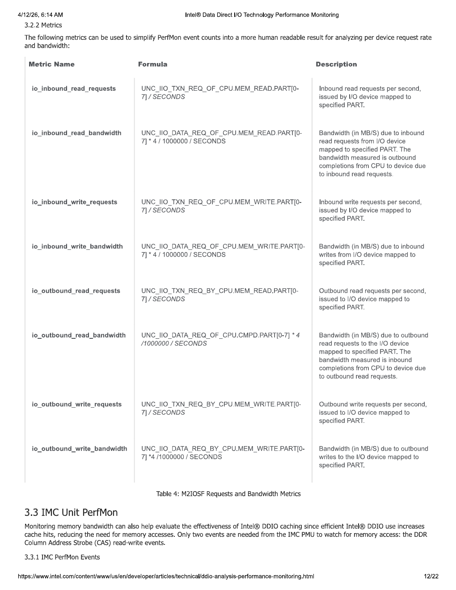

### OCR Text

3.2.2 Metrics

Intel® Data Direct VO Technology Performance Monitoring

The following metrics can be used to simplify PerfMon event counts into a more human readable result for analyzing per device request rate

and bandwidth:

Metric Name

io_inbound_read_requests

io_inbound_read_bandwidth

io_inbound_write_requests

io_inbound_write_bandwidth

io_outbound_read_requests

io_outbound_read_bandwidth

io_outbound_write_requests

io_outbound_write_bandwidth

3.3 IMC Unit PerfMon

Formula

UNC_110_TXN_REQ_OF_CPU.MEM_READ.PART[O-
71/ SECONDS

UNC_II0_DATA_REQ_OF_CPU.MEM_READ.PART[0-
7)* 41 1000000 / SECONDS

UNC_110_TXN_REQ_OF_CPU.MEM_WRITE.PART[0-
7] / SECONDS

UNC_II0_DATA_REQ_OF_CPU.MEM_WRITE.PART[O-
7] * 4/ 1000000 / SECONDS

UNC_IIO_TXN_REQ_BY_CPU,MEM_READ.PART[O-
7|/ SECONDS

UNC_110_DATA_REQ_OF_CPU.CMPD.PART|0-7] * 4
/1000000 / SECONDS

UNC_IIO_TXN_REQ_BY_CPU.MEM_WRITE.PART[0-
7|/ SECONDS

UNC_110_DATA_REQ_BY_CPU.MEM_WRITE.PART(O-
7] *4 /1000000 / SECONDS

Table 4: M2IOSF Requests and Bandwidth Metrics

Description

Inbound read requests per second,
issued by VO device mapped to
specified PART.

Bandwidth (in MB/S) due to inbound
read requests from I/O device
mapped to specified PART. The
bandwidth measured is outbound
completions from CPU to device due
to inbound read requests

Inbound write requests per second,
issued by /O device mapped to
specified PART.

Bandwidth (in MB/S) due to inbound
writes from //O device mapped to
specified PART.

Outbound read requests per second,
issued to I/O device mapped to
specified PART.

Bandwidth (in MB/S) due to outbound
read requests to the I/O device
mapped to specified PART. The
bandwidth measured is inbound
completions from CPU to device due
to outbound read requests.

Outbound write requests per second,
issued to I/O device mapped to
specified PART.

Bandwidth (in MB/S) due to outbound
writes to the /O device mapped to
specified PART.

Monitoring memory bandwidth can also help evaluate the effectiveness of Intel® DDIO caching since efficient Intel® DDIO use increases
cache hits, reducing the need for memory accesses. Only two events are needed from the IMC PMU to watch for memory access: the DDR
Column Address Strobe (CAS) read-write events.

3.3,1 IMC PerfMon Events

https:/Avww.intel,com/content/www/us/en/developer/articles/technical/ddio-analysis-performance-monitoring.html

12122

## Page 13

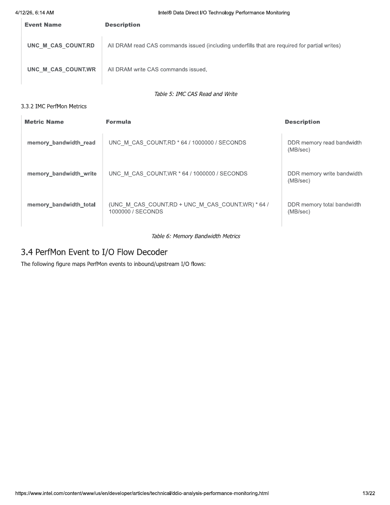

### OCR Text

Event Name

UNC_M_CAS_COUNT.RD

UNC_M_CAS_COUNT.WR

3.3.2 IMC PerfMon Metrics

Metric Name

memory_bandwidth_read

memory_bandwidth_write

memory_bandwidth_total

Intel® Data Direct VO Technology Performance Monitoring

Description

All DRAM read CAS commands issued (including underfills that are required for partial writes)

All DRAM write CAS commands issued.

Table 5: IMC CAS Read and Write

Formula

UNC_M_CAS_COUNT.RD * 64 / 1000000 / SECONDS

UNC_M_CAS_COUNT.WR * 64 / 1000000 / SECONDS,

(UNC_M_CAS_COUNT.RD + UNC_M_CAS_COUNT.WR) * 64/

1000000 / SECONDS

Table 6: Memory Bandwidth Metrics

3.4 PerfMon Event to I/O Flow Decoder

The following figure maps PerfMon events to inbound/upstream I/O flows:

https:/Avww.intel,com/content/www/us/en/developer/articles/technical/ddio-analysis-performance-monitoring.html

Description

DDR memory read bandwidth
(MB/sec)

DDR memory write bandwidth
(MB/sec)

DDR memory total bandwidth
(MB/sec)

13/22

## Page 14

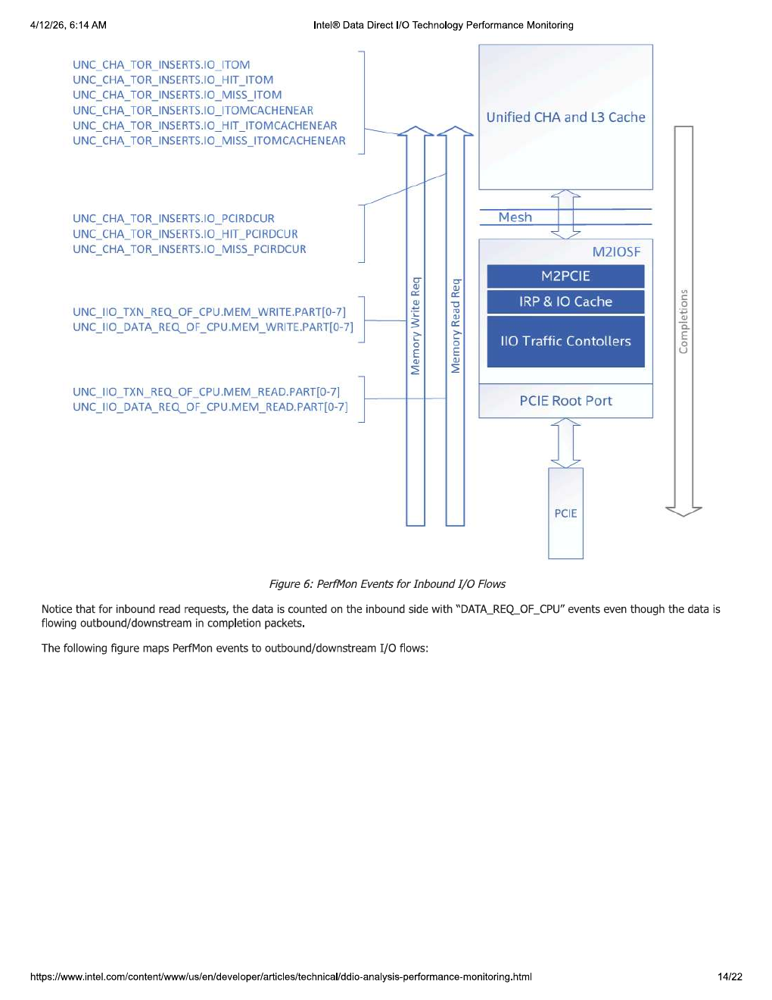

### OCR Text

UNC_CHA_TOR_INSERTS.IO_ITOM
UNC_CHA_TOR_INSERTS.IO_HIT_ITOM
UNC_CHA_TOR_INSERTS.IO_MISS_ITOM

UNC_CHA_TOR_INSERTS.IO_ITOMCACHENEAR Unified CHA and L3 Cache

UNC_CHA_TOR_INSERTS.IO_HIT_ITOMCACHENEAR = |__ a
UNC_CHA_TOR_INSERTS.IO_MISS_ITOMCACHENEAR rit
ee a
UNC_CHA_TOR_INSERTS.IO_PCIRDCUR Mesh
UNC_CHA_TOR_INSERTS.IO_HIT_PCIRDCUR
UNC_CHA_TOR_INSERTS.IO_MISS_PCIRDCUR M2I0SF
c| eel PAG lot
é 2 2
‘| s| |3 IRP & IO Cache &
UNC_lIO_TXN_REQ_OF_CPU.MEM_WRITE.PART[O-7] =| 18 3
UNC_lIO_DATA_REQ_OF_CPU.MEM_WRITE.PART[0-7] el |e 2
2 S s OM Relient icy a
—| |& 6
5] |a
2 = =
UNC_liO_TXN_REQ_OF_CPU.MEM_READ.PARTIO-7]
UNC_llO_DATA_REQ_OF_CPU.MEM_READ.PART[O-7] PCIE Root Port
PCIE SS

Figure 6: PerfMon Events for Inbound I/O Flows

Notice that for inbound read requests, the data is counted on the inbound side with “DATA_REQ_OF_CPU” events even though the data is
flowing outbound/downstream in completion packets.

The following figure maps PerfMon events to outbound/downstream I/O flows:

https:/Avww.intel,com/content/www/us/en/developer/articles/technical/ddio-analysis-performance-monitoring.html 14122

## Page 15

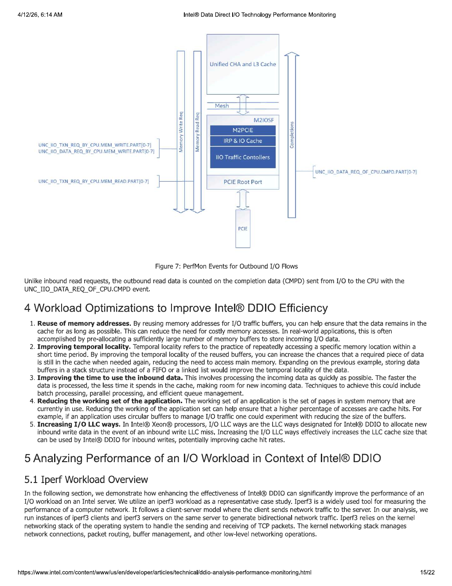

### OCR Text

Unified CHA and 3 Cache

“Mesh

M2i0SF

REQ_BY_CPU.MEM_WRITE.PART(O-7}
'A_REQ_BY_CPU.MEM_WRITE.PART(O-7]

UNC_lO_DATA_REQ_OF CPU.

(CMPD. PARTIO-7.

UNC_O_TXN_REQ_@Y_CPU.MEM_READ.PART(O-7]

PCE

Figure 7: PerfMon Events for Outbound I/O Flows

Unlike inbound read requests, the outbound read data is counted on the completion data (CMPD) sent from I/O to the CPU with the
UNC_IIO_DATA_REQ_OF_CPU.CMPD event.

4 Workload Optimizations to Improve Intel® DDIO Efficiency

1

Reuse of memory addresses, By reusing memory addresses for 1/0 traffic buffers, you can help ensure that the data remains in the
cache for as long as possible. This can reduce the need for costly memory accesses. In real-world applications, this is often
accomplished by pre-allocating a sufficiently large number of memory buffers to store incoming I/O data.

Improving temporal locality. Temporal locality refers to the practice of repeatedly accessing a specific memory location within a
short time period. By improving the temporal locality of the reused buffers, you can increase the chances that a required piece of data
is still in the cache when needed again, reducing the nead to access main memory. Expanding on the previous example, storing data
buffers in a stack structure instead of a FIFO or a linked list would improve the temporal locality of the data,

Improving the time to use the inbound data. This involves processing the incoming data as quickly as possible. The faster the
data is processed, the less time it spends in the cache, making room for new incoming data, Techniques to achieve this could include
batch processing, parallel processing, and efficient queue management.

Reducing the working set of the application. The working set of an application is the set of pages in system memory that are
currently in use. Reducing the working of the application set can help ensure that a higher percentage of accesses are cache hits. For
example, if an application uses circular buffers to manage 1/0 traffic one could experiment with reducing the size of the buffers.
Increasing 1/0 LLC ways. In Intel® Xeon® processors, I/O LLC ways are the LLC ways designated for Intel® DDIO to allocate new
inbound write data in the event of an inbound write LLC miss, Increasing the I/O LLC ways effectively increases the LLC cache size that
can be used by Intel® DDIO for inbound writes, potentially improving cache hit rates.

5 Analyzing Performance of an I/O Workload in Context of Intel® DDIO

5.1 Iperf Workload Overview

In the following section, we demonstrate how enhancing the effectiveness of Intel® DDIO can significantly improve the performance of an
1/0 workload on an Intel server. We utilize an iperf3 workload as a representative case study. Iperf3 is a widely used tool for measuring the
performance of a computer network. It follows a client-server model where the client sends network traffic to the server. In our analysis, we
run instances of iperf3 clients and iperf3 servers on the same server to generate bidirectional network traffic. Iperf3 relies on the kernel
networking stack of the operating system to handle the sending and receiving of TCP packets. The kernel networking stack manages
network connections, packet routing, buffer management, and other low-level networking operations.

https:/Avww.intel,com/content/www/us/en/developer/articles/technical/ddio-analysis-performance-monitoring.html 15/22

## Page 16

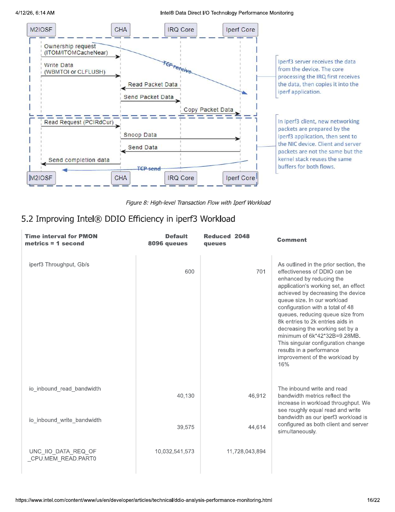

### OCR Text

packets are prepared by the
Snoop Data iperf application, then sent to

|
|
| Ihe NIC device. Client and server
|
|

Send Data
packets are not the same but the

kernel stack reuses the same
buffers for both flows.

| | Ownership request
(TOM/ITOMCacheNear)
LV simiiiate Iperf3 server receives the data
|} (wamTot or CLFLUSH) from the device. The core
| processing the IRQ first receives
| Read Packet Data the data, then copies it into the
t i iperf application.
I Send Packet Data t |
ee 1
| Copy Packet Data |
ht a ee fee te ee Sa a ee el
[- TRead Request (PCIRACury tT 1 In iperf3 client, new networking
| t
|
|
|

tq Sone Date
Send completion data

jms a ae

IMaiosF cha | IRQ Core Iperf Corel

Figure 8: High-level Transaction Flow with Iperf Workload
5.2 Improving Intel® DDIO Efficiency in iperf3 Workload

e interval for PMON Default Reduced 2048
S = 1 second 8096 queues queues

Comment

iperf3 Throughput, Gb/s As outlined in the prior section, the
600 701 effectiveness of DDIO can be

enhanced by reducing the
application's working set, an effect
achieved by decreasing the device
queue size. In our workload
configuration with a total of 48
queues, reducing queue size from
8k entries to 2k entries aids in
decreasing the working set by a
minimum of 6k"42*32B=9.28MB.
This singular configuration change
results in a performance
improvement of the workload by
16%

io_inbound_read_bandwidth The inbound write and read

40,130 46,912 bandwidth metrics reflect the
increase in workload throughput. We
see roughly equal read and write
bandwidth as our iperf3 workload is

39,675 44,614 configured as both client and server
simultaneously.

io_inbound_write_bandwidth

UNC_1I0_DATA_REQ_OF 10,032,541,573 11,728,043,894
_CPU.MEM_READ.PARTO

https:/Avww.intel,com/content/www/us/en/developer/articles/technical/ddio-analysis-performance-monitoring.html 16122

## Page 17

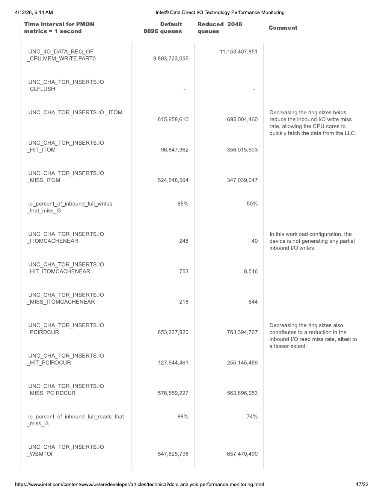

### OCR Text

Time interval for PMON
metrics = 1 second

UNC_IIO_DATA_REQ_OF
_CPU.MEM_WRITE.PARTO

UNC_CHA_TOR_INSERTS.IO
_CLFLUSH

UNC_CHA_TOR_INSERTS.IO_ITOM

UNC_CHA_TOR_INSERTS.IO
_HIT_ITOM

UNC_CHA_TOR_INSERTS.IO
_MISS_ITOM

io_percent_of_inbound_full_writes

_that_miss_|3

UNC_CHA_TOR_INSERTS.IO
_ITOMCACHENEAR

UNC_CHA_TOR_INSERTS.IO
_HIT_ITOMCACHENEAR

UNC_CHA_TOR_INSERTS.IO
_MISS_ITOMCACHENEAR

UNC_CHA_TOR_INSERTS.IO
_PCIRDCUR

UNC_CHA_TOR_INSERTS.IO
_HIT_PCIRDCUR

UNC_CHA_TOR_INSERTS.|O
_MISS_PCIRDCUR

io_percent_of_inbound_full_reads_that

_miss_13

UNC_CHA_TOR_INSERTS.IO
_WBMTOI

Intel® Data Direct VO Technology Performance Monitoring

Default
8096 queues

9,893,723,055

615,958,610

96,847,962

524,548,564

85%

248

753

218

653,237,920

127,544,461

576,559,227

88%

547,825,798

Reduced 2048
queues

Comment

11,183,407,851

Decreasing the ring sizes helps

695,004,460 reduce the inbound VO write miss
rate, allowing the CPU cores to
quickly fetch the data from the LLC.

356,015,603

347,039,047

50%

In this workload configuration, the
40 device is not generating any partial
inbound 1/0 writes.

8,516

644

Decreasing the ring sizes also

763,394,767 contributes to a reduction in the
inbound |/O read miss rate, albeit to
a lesser extent.

255,145,459

563,896,953

74%

657,470,490

https:/Avww.intel,com/content/www/us/en/developer/articles/technical/ddio-analysis-performance-monitoring.html 17122

## Page 18

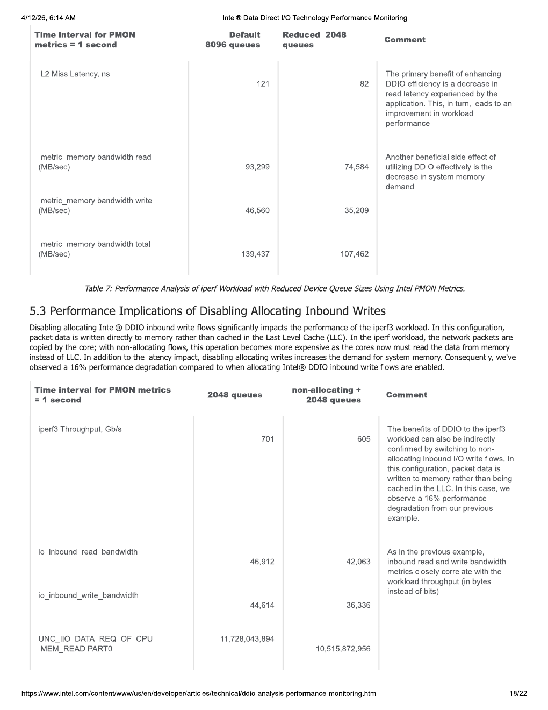

### OCR Text

Time interval for PMON
metrics = 1 second

L2 Miss Latency, ns

metric_memory bandwidth read
(MB/sec)

metric_memory bandwidth write
(MB/sec)

metric_memory bandwidth total
(MB/sec)

Intel® Data Direct VO Technology Performance Monitoring

Default Reduced 2048

8096 queues queues Comment

The primary benefit of enhancing

121 82 DDIO efficiency is a decrease in
read latency experienced by the
application. This, in turn, leads to an
improvement in workload
performance

Another beneficial side effect of

93,299 74,584 utilizing DDIO effectively is the
decrease in system memory
demand.

46,560 35,209

139,437 107,462

Table 7: Performance Analysis of iperf Workload with Reduced Device Queue Sizes Using Intel PMON Metrics.

5.3 Performance Implications of Disabling Allocating Inbound Writes

Disabling allocating Intel® DDIO inbound write flows significantly impacts the performance of the iperf3 workload. In this configuration,
packet data is written directly to memory rather than cached in the Last Level Cache (LLC). In the iperf workload, the network packets are
copied by the core; with non-allocating flows, this operation becomes more expensive as the cores now must read the data from memory
instead of LLC. In addition to the latency impact, disabling allocating writes increases the demand for system memory. Consequently, we've
observed a 16% performance degradation compared to when allocating Intel® DDIO inbound write flows are enabled.

Time interval for PMON metrics

= 41 second

iperf3 Throughput, Gb/s

io_inbound_read_bandwidth

io_inbound_write_bandwidth

UNC_lIO_DATA_REQ_OF_CPU
MEM_READ.PARTO

non-allocating +

2048 queues 2048 queues

Comment

The benefits of DDIO to the ipert3

701 605 workload can also be indirectly
confirmed by switching to non-
allocating inbound V/O write flows. In
this configuration, packet data is
written to memory rather than being
cached in the LLC. In this case, we
observe a 16% performance
degradation from our previous
example.

As in the previous example,

46,912 42,063 inbound read and write bandwidth
metrics closely correlate with the
workload throughput (in bytes
instead of bits)

44,614 36,336

11,728,043,894
10,515,872,956

https:/Avww.intel,com/content/www/us/en/developer/articles/technical/ddio-analysis-performance-monitoring.html 18122

## Page 19

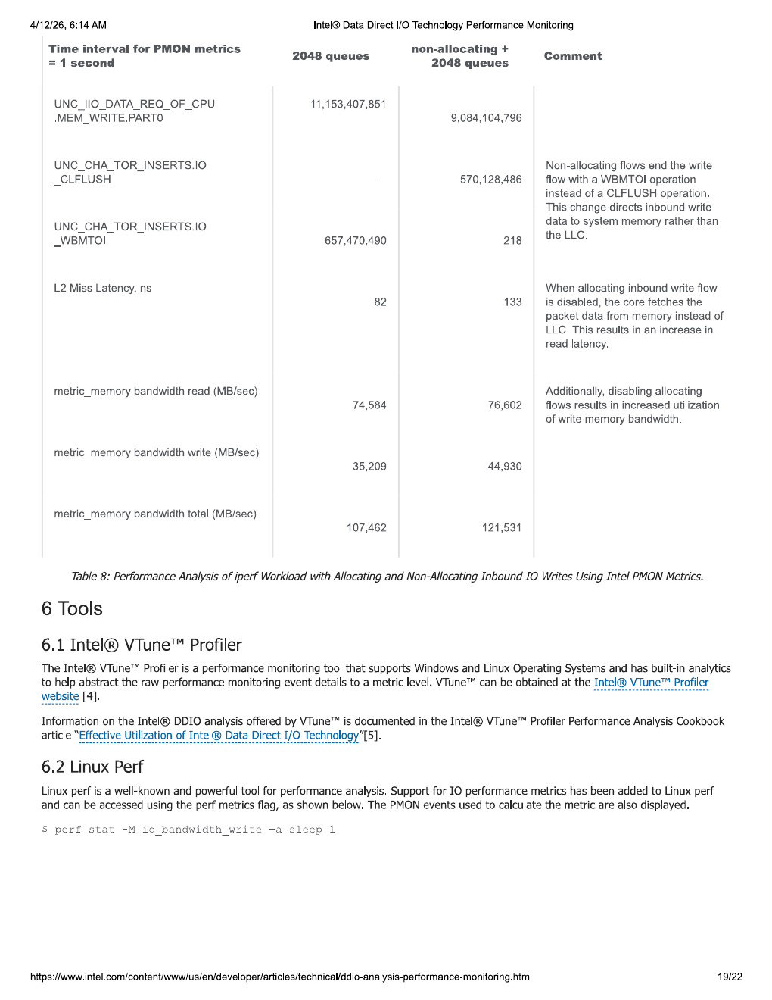

### OCR Text

Time interval for PMON metrics non-allocating +

= 41 second 2048 queues 2048 queues Comment
UNC_ll0_DATA_REQ_OF_CPU 11,153,407,851
MEM_WRITE.PARTO 9,084,104,796
UNC_CHA_TOR_INSERTS.I0 Non-allocating flows end the write
_CLFLUSH - 570,128,486 flow with a WBMTOI operation
instead of a CLFLUSH operation.
This change directs inbound write
UNC_CHA_TOR_INSERTS.10 data to system memory rather than
_WBMTOI 657,470,490 21g the LLC.
L2 Miss Latency, ns When allocating inbound write flow
82 133 is disabled, the core fetches the
packet data from memory instead of
LLC. This results in an increase in
read latency.
metric_memory bandwidth read (MB/sec) Additionally, disabling allocating
74,584 76,602 flows results in increased utilization
of write memory bandwidth.
metric_memory bandwidth write (MB/sec)
35,209 44,930
metric_memory bandwidth total (MB/sec)
107,462 121,531

Table 8: Performance Analysis of iperf Workload with Allocating and Non-Allocating Inbound IO Writes Using Intel PMON Metrics.

6 Tools

6.1 Intel® VTune™ Profiler

The Intel® VTune™ Profiler is a performance monitoring tool that supports Windows and Linux Operating Systems and has built-in analytics
to help abstract the raw performance monitoring event details to a metric level. VTune™ can be obtained at the Intel "Profiler
ite [4]

Information on the Intel® DDIO analysis offered by VTune™ is documented in the Intel® VTune™ Profiler Performance Analysis Cookbook
article “Effe U f hnology’T5].

6.2 Linux Perf

Linux perf is a well-known and powerful tool for performance analysis. Support for IO performance metrics has been added to Linux perf
and can be accessed using the perf metrics flag, as shown below, The PMON events used to calculate the metric are also displayed.

io_bandwidth write -a sle:

https:/Avww.intel,com/contentiwww/us/en/developer/articles/technical/ddio-analysis-performance-monitoring.html 19/22

## Page 20

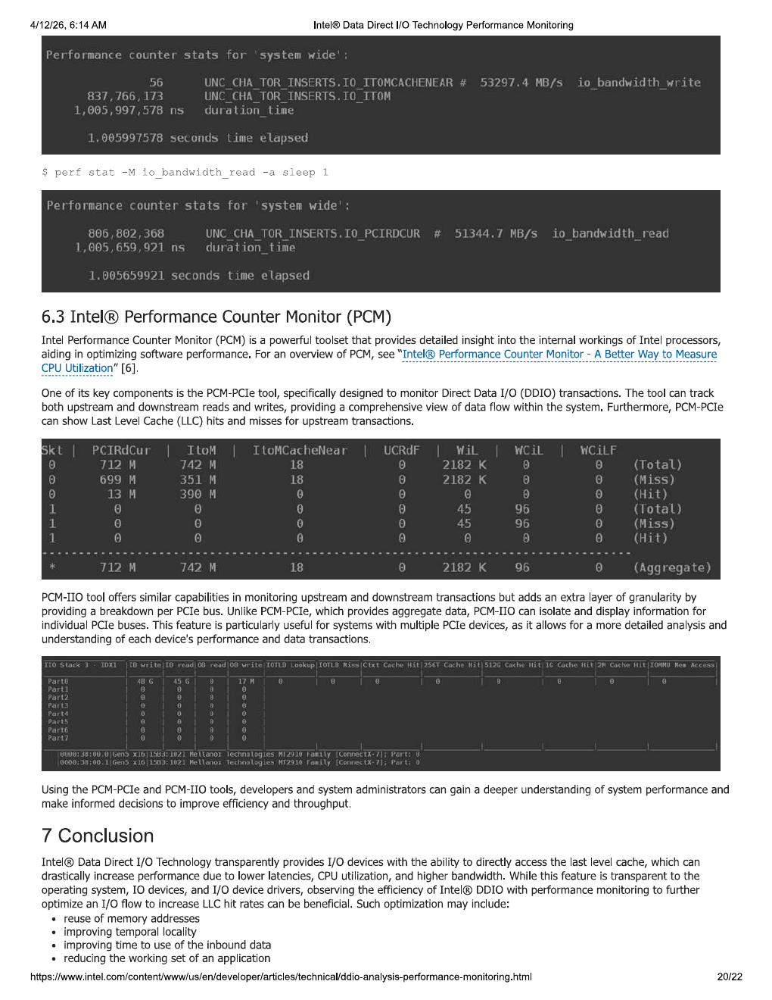

### OCR Text

UNC_CHA OM TCE LE
juratioi

6.3 Intel® Performance Counter Monitor (PCM)

Intel Performance Counter Monitor (PCM) is a powerful toolset that provides detailed insight into the internal workings of Intel processors,
aiding in optimizing software performance, For an overview of PCM, see™

” (6)

One of its key components is the PCM-PCle tool, specifically designed to monitor Direct Data I/O (DDIO) transactions. The tool can track
both upstream and downstream reads and writes, providing a comprehensive view of data flow within the system, Furthermore, PCM-PCIe
can show Last Level Cache (LLC) hits and misses for upstream transactions.

PCM-IIO tool offers similar capabilities in monitoring upstream and downstream transactions but adds an extra layer of granularity by
providing a breakdown per PCle bus. Unlike PCM-PCle, which provides aggregate data, PCM-IIO can isolate and display information for
individual PCIe buses. This feature is particularly useful for systems with multiple PCIe devices, as it allows for a more detailed analysis and
understanding of each device's performance and data transactions.

Using the PCM-PCIe and PCM-IIO tools, developers and system administrators can gain a deeper understanding of system performance and
make informed decisions to improve efficiency and throughput.

7 Conclusion

Intel® Data Direct I/O Technology transparently provides 1/0 devices with the ability to directly access the last level cache, which can
drastically increase performance due to lower latencies, CPU utilization, and higher bandwidth. While this feature is transparent to the
operating system, IO devices, and I/O device drivers, observing the efficiency of Intel® DDIO with performance monitoring to further
optimize an 1/0 flow to increase LLC hit rates can be beneficial. Such optimization may include:

+ reuse of memory addresses

+ improving temporal locality

+ improving time to use of the inbound data

+ reducing the working set of an application

https:/Awww.intel.com/content/www/us/en/developer/articles/technical/ddio-analysis-performance-monitoring.html 20/22

## Page 21

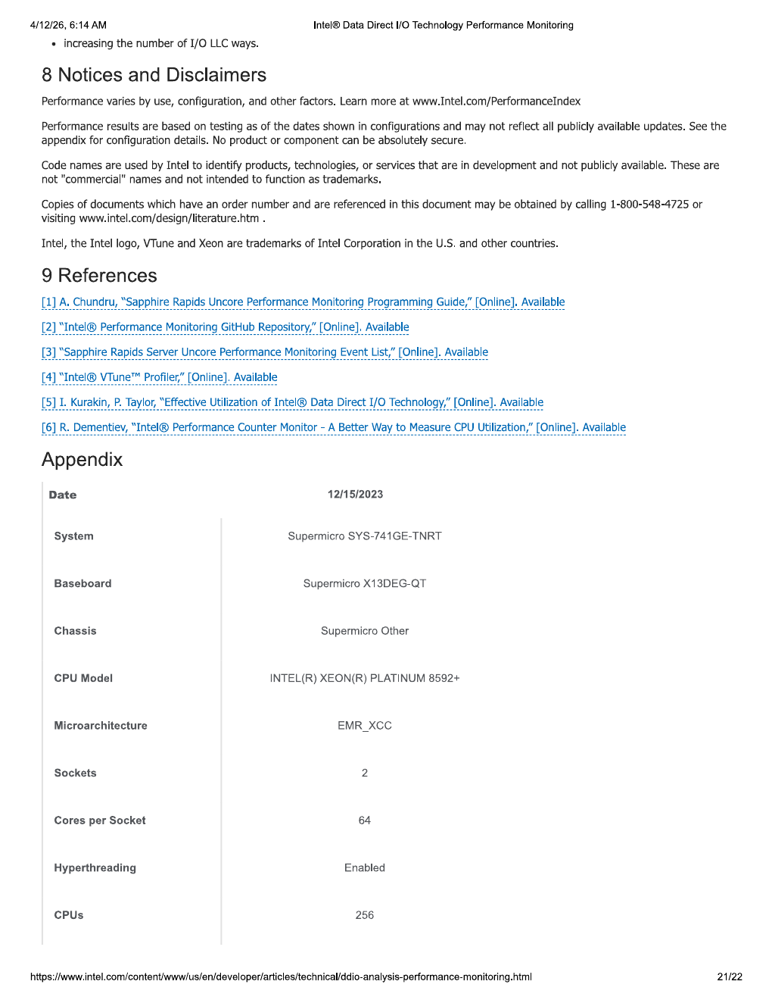

### OCR Text

4112126, 6:14 AM Intel® Data Direct I/O Technology Performance Monitoring
+ increasing the number of I/O LLC ways.

8 Notices and Disclaimers
Performance varies by use, configuration, and other factors. Learn more at www.Intel.com/Performancelndex

Performance results are based on testing as of the dates shown in configurations and may not reflect all publicly available updates. See the
appendix for configuration details. No product or component can be absolutely secure

Code names are used by Intel to identify products, technologies, or services that are in development and not publicly available. These are
not "commercial" names and not intended to function as trademarks.

Copies of documents which have an order number and are referenced in this document may be obtained by calling 1-800-548-4725 or
visiting www.intel.com/design/literature.htm .

Intel, the Intel logo, VTune and Xeon are trademarks of Intel Corporation in the U.S. and other countries.

9 References

* Progran

[2] MIntel® Performance Monitoring GitHub Repository,” [Online], Available

[3] “Sapphire Rapids Server Uncore Performance Monitoring Event List,” [Online]. Available

Appendix

Date 12/15/2023

System Supermicro SYS-741GE-TNRT
Baseboard ‘Supermicro X13DEG-QT
Chassis Supermicro Other

‘CPU Model INTEL(R) XEON(R) PLATINUM 8592+
Microarchitecture EMR_XCC
Sockets 2

Cores per Socket 64
Hyperthreading Enabled

CPUs 256

https:/Avww.intel,com/content/www/us/en/developer/articles/technical/ddio-analysis-performance-monitoring.html 2122

## Page 22

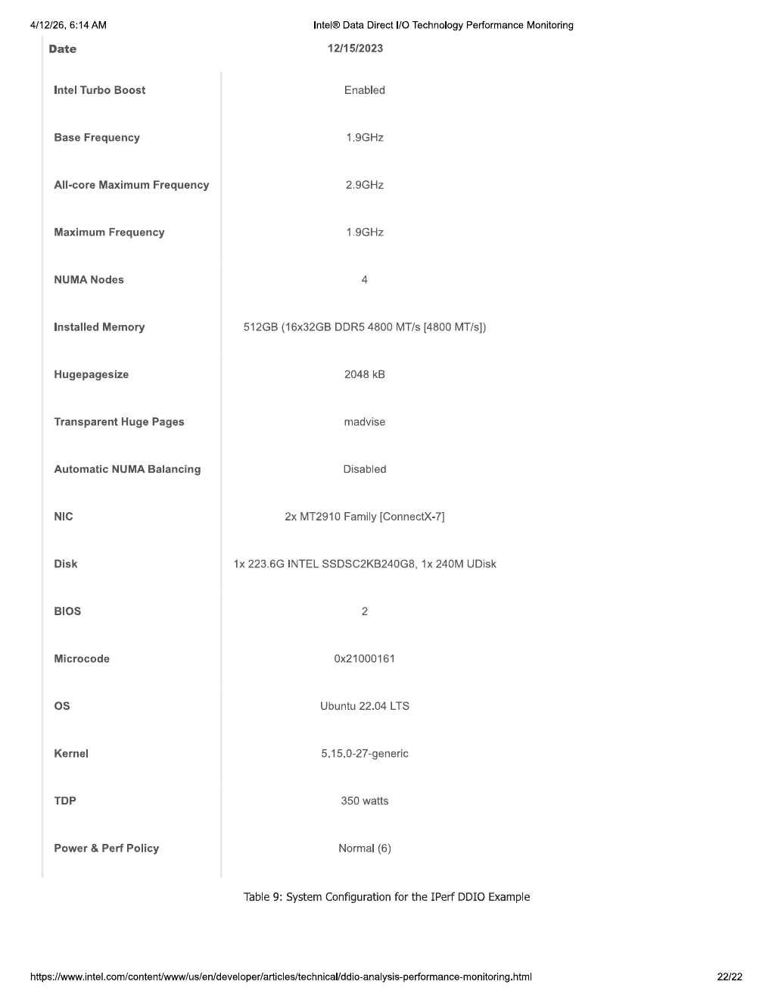

### OCR Text

Date

Intel Turbo Boost

Base Frequency

All-core Maximum Frequency

Maximum Frequency

NUMA Nodes

Installed Memory

Hugepagesize

Transparent Huge Pages

Automatic NUMA Balancing

NIC

Disk

BIOS

Microcode

os

Kernel

TOP

Power & Perf Policy

Intel® Data Direct VO Technology Performance Monitoring
12/15/2023

Enabled

1.9GHz

2.9GHz

1.9GHz

512GB (16x32GB DDRS5 4800 MT/s [4800 MT/s])

2048 kB

madvise

Disabled

2x MT2910 Family [ConnectX-7]

1x 223.6G INTEL SSDSC2KB240G8, 1x 240M UDisk

0x21000161

Ubuntu 22.04 LTS

5.15.0-27-generic

350 watts

Normal (6)

Table 9: System Configuration for the IPerf DDIO Example

https:/Avww.intel,com/content/www/us/en/developer/articles/technical/ddio-analysis-performance-monitoring.html

2222

