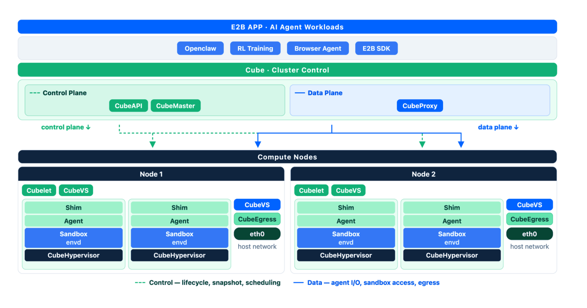

## Introduction
CubeSandbox is designed for AI Agent code execution, where ultra-fast cold-start and high concurrency are the two most critical metrics. This post presents performance benchmark data measured on a real bare-metal node, majorly focus on:

- **Create sandbox from Template** — cold-start latency, concurrency scaling, single-host deployment density

**Important: all benchmark numbers are highly dependent on the test environment and workload.** Contributing factors include (but are not limited to) host CPU, memory, IO performance.

- Source code: [Git repo](https://github.com/TencentCloud/CubeSandbox)   
- How to install: [Installation-Guide-EN](docs/cube-sandbox-install-diagnosis_EN.md), [Installation-Guide-CN](docs/cube-sandbox-install-diagnosis_CN.md) 
  - Recommend to install an additional disk, formated to XFS and mounted to `/data` before install cubeSandbox.
  - Install the docker before deploy cubesandbox. 
- More Info: [Official website](https://cubesandbox.com/)

## Pre-check environemnt before deployment
- Install an data disk, formated to `XFS` and mounted to `/data`.
- Ensure the docker tool is installed before deploy cubesandbox;
- Ensure docker build can work with system proxy in intel lab;
- Ensure the eBPF is enabled in the kernel, if not please enable it and rebuild kernel.
```
ls -l /sys/kernel/btf/vmlinux
grep -E 'CONFIG_DEBUG_INFO_BTF|CONFIG_BPF_SYSCALL|CONFIG_BPF_JIT' /boot/config-$(uname -r)
```

## How to Benchmark

### Cold-Start Latency and Concurrency Scaling

Genarically, we run the cube_bench to benchmark cubeSandbox create latency, it supports 2 benchmark mode: create-delete | create-only (default "create-delete"). as customer's request, we just need to benchmark the ()`-m create-delete`) mode with 3 rounds warmup (`-w 3`)


#### 1. Create Template - Sandbox Spec and Template Creation

All tests use sandboxes with the following spec:

| Item | Detail |
|------|--------|
| Spec | 2 vCPU / 2 GiB memory |
| Test Image | `cube-sandbox-cn.tencentcloudcr.com/cube-sandbox/sandbox-code:latest` |
| Storage | CoW reflink (XFS, `/data/cubelet/storage/`) |
| Memory Tracking | soft-dirty (`/proc/PID/clear_refs`) |

Build the template before running any tests (use `cn` registry in China, `int` elsewhere), by default, it's defined with 2vcpu and 2GiB memory.

```bash
cubemastercli tpl create-from-image \
  --image cube-sandbox-cn.tencentcloudcr.com/cube-sandbox/sandbox-code:latest \
  --writable-layer-size 1G \
  --expose-port 49999 \
  --expose-port 49983 \
  --probe 49999
```

After the build finishes, note the template ID:

```bash
# List templates and grab the first tpl- prefixed ID
cubemastercli tpl list
```

#### 2. Run benchmark
Use the [`cube-bench`](https://github.com/TencentCloud/CubeSandbox/tree/master/examples/cube-bench) tool to measure sandbox creation latency at different concurrency levels. `cube-bench` drives CubeAPI via Go goroutines and reports full percentile statistics.

**Build (requires Go 1.21+):**

```bash
cd examples/cube-bench
make
# output: ./bin/cube-bench
```

**Run (examples for concurrency 1 and 50):**

```bash
# Set environment variables
export E2B_API_URL=http://<your-server-ip>:3000   
or export E2B_API_URL=http://127.0.0.1:3000
export E2B_API_KEY=e2b_000000
export CUBE_TEMPLATE_ID=<your-template-id>

# 1-concurrent, 20 total, create-delete (default mode)
./bin/cube-bench -c 1 -n 20 -w 3 

# 50-concurrent, 500 total
./bin/cube-bench -c 50 -n 500 -w 3 

# Export JSON report
./bin/cube-bench -c 50 -n 500 -w 3 -o report_c50.json
```


## Architecture

<p align="center">
  
</p>

| Component | Responsibility |
|---|---|
| **CubeAPI** | High-concurrency REST API Gateway (Rust), compatible with E2B. Swap the URL for seamless migration. |
| **CubeMaster** | Cluster orchestrator. Receives API requests and dispatches them to corresponding Cubelets. Manages resource scheduling and cluster state. |
| **CubeProxy** | Reverse proxy, compatible with the E2B protocol, routing requests to the appropriate sandbox instances. |
| **Cubelet** | Compute node local scheduling component. Manages the complete lifecycle of all sandbox instances on the node. |
| **CubeVS** | eBPF-based virtual switch, providing kernel-level network isolation and security policy enforcement. |
| **CubeEgress** | OpenResty-based egress security gateway: L7 domain filtering, credential injection, and access auditing; works with CubeVS kernel policies so sandbox traffic cannot bypass inspection. |
| **CubeHypervisor & CubeShim** | Virtualization layer — CubeHypervisor manages KVM MicroVMs, CubeShim implements the containerd Shim v2 API to integrate sandboxes into the container runtime. |

👉 For more details, please read the [Architecture Design Document](https://github.com/TencentCloud/CubeSandbox/blob/master/docs/architecture/overview.md) and [CubeVS Network Model](https://github.com/TencentCloud/CubeSandbox/blob/master/docs/architecture/network.md).


## BKM for benchmark on CWF
- Enable SNC mode and LOM mode, this can improve the perf on small instance with less concurrrency
- Update the Linux kernel to v7.1 or latest;
- Set the kernel preempt mode to `lazy` mode;
  ```
  cat /sys/kernel/debug/sched/preempt  
  ```
- Set `ibt=off` in kernel parameter to workaround the compability issue between VM and Host, just for benchmark;

#### Tune the config for cubeSandbox:
Enlarge the limitation for concurrency, and restart all of the service;
- in /usr/local/services/cubetoolbox/CubeMaster/conf.yaml
```
  create_concurrent_limit: 500 # default is 100
  destroy_concurent_limit: 500 # default is 100
```
- in /usr/local/services/cubetoolbox/Cubelet/config/config.toml
```
[plugins."io.cubelet.workflow.v1.workflow".flows.create]
        concurrent = 500   # default is 100
        actions = [["createid", "appsnapshot"],["images","volume","storage","network","netfile", "cube-sandbox-store"],["cgroup"],["cubebox"]]
      [plugins."io.cubelet.workflow.v1.workflow".flows.destroy]
        concurrent = 500   # default is 100
        actions = [["cubebox"],["images","storage","cgroup","network","volume","netfile", "cube-sandbox-store"],["cleanup"]]
```
 - Restart services to make the change effected
``` bash 
systemctl restart cube-sandbox-mysql.service cube-sandbox-redis.service cube-sandbox-cubemaster.service cube-sandbox-cube-api.service
```

## Docs and test data
[CubeSandbox_SRF_CWF_Turin-D_analysis](https://intel-my.sharepoint.com/personal/michael_m_zhang_intel_com/Documents/0_work/11_Workload/CubeSandbox/cubeSandbox-cwf-analysis.pptx?web=1)