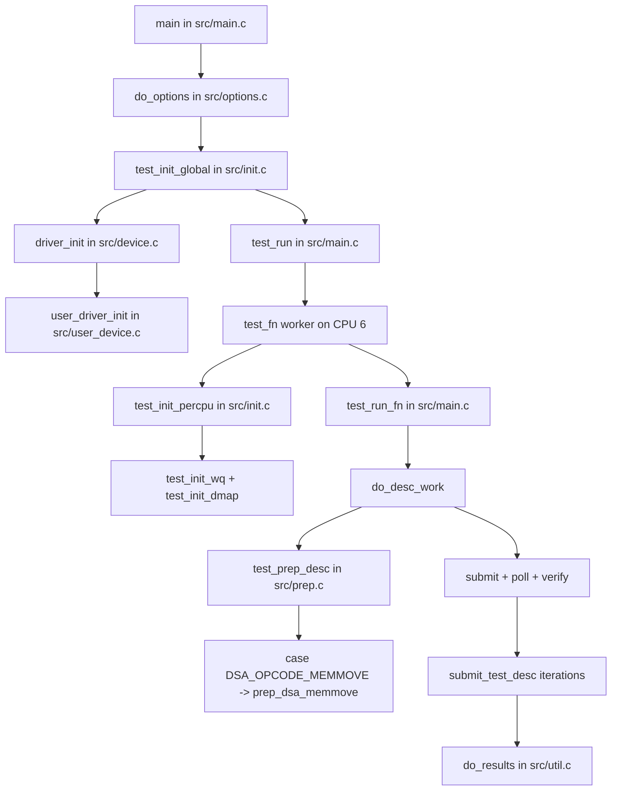

# dsa_perf_micros Code Flow Analysis

## Scope
This note summarizes the runtime code flow for:

`./src/dsa_perf_micros -k 6 -u -i 1000 -n 128 -s 1024k -o3 -w 0`

Background assumptions used:
- DSA = Intel Data Streaming Accelerator
- `-u` = userspace driver path (for example `vfio-pci`)
- `-o3` = MEMMOVE test path for this project usage

## Effective Runtime Configuration
- One worker bound to CPU core 6 (`-k 6`)
- Userspace backend selected (`-u`)
- Dedicated work queue selected (`-w 0`)
- Iterations = 1000 (`-i 1000`)
- Buffer count = 128 (`-n 128`)
- Transfer size = 1024 KiB per descriptor (`-s 1024k`)
- Operation = MEMMOVE (`-o3`)

## End-to-End Flow

1. Program entry (`src/main.c`)
- Initializes default `tcfg`
- Parses command line (`do_options`)
- Runs global init (`test_init_global`)
- Starts test workers (`test_run`)
- Aggregates and prints results (`do_results`)

2. Option parsing (`src/options.c`)
- Parses `-k`, `-u`, `-i`, `-n`, `-s`, `-o`, `-w`
- Builds one `tcpu` entry for CPU 6
- Keeps DMA mode enabled (since `-m` is not set)

3. Global initialization (`src/init.c`)
- Pins and probes NUMA for configured CPU(s)
- Calculates descriptor count (`nb_desc`)
- Initializes backend driver via `driver_init`
- Allocates descriptor/completion/data buffers

4. Userspace DSA backend (`src/device.c` -> `src/user_device.c`)
- `driver_init` dispatches to `user_driver_init`
- Detects/uses UIO or VFIO userspace path
- For VFIO path: sets up container/group/device, BAR mapping, IOMMU map
- Exposes WQ portal and metadata via `ud_wq_get` / `ud_wq_info_get`

5. Per-worker init (`test_init_percpu`)
- Worker thread pins to CPU 6
- Maps dedicated WQ (`test_init_wq`)
- DMA maps descriptors, completions, and buffers (`test_init_dmap`)

6. Descriptor preparation (`src/prep.c`)
- `test_prep_desc` selects operation branch by opcode
- MEMMOVE path enters `case DSA_OPCODE_MEMMOVE` and calls `prep_dsa_memmove`
- For each of 128 descriptors:
  - fill `src_addr`
  - fill `dst_addr`
  - set `xfer_size = 1024 KiB`
  - attach completion record address

7. Execution path (`src/main.c`)
- `test_run_fn` -> `do_desc_work`
- Performs initial submit/poll/check/verify pass
- Runs measured loop (`submit_test_desc` when `-j` is not set)
- Submits descriptors to WQ portal (`dsa_desc_submit`)
- Polls completion records and tracks cycles

8. Verification and metrics (`src/util.c`)
- Verifies MEMMOVE destination equals source (`verify_buf`)
- Calculates cycles, bandwidth, latency, ops rate (`do_results`)

## Descriptor Lifecycle (for this command)

1. Build descriptor in `prep_dsa_memmove`
2. Convert virtual addresses to IOVA (`rte_mem_virt2iova` path)
3. Submit descriptor to dedicated WQ portal
4. Hardware executes DSA MEMMOVE
5. Completion record is written
6. Software polls completion and checks status
7. Verify destination buffer matches source buffer

## Flow Diagram

## Summary Table

| Stage | Main Function(s) | Outcome for `-k 6 -u -i 1000 -n 128 -s 1024k -o3 -w 0` |
|---|---|---|
| Parse CLI | `do_options`, `do_getopt` | One worker on CPU 6, userspace backend, dedicated WQ, MEMMOVE config |
| Global init | `test_init_global` | NUMA/cycle setup, backend init, memory allocation |
| Userspace setup | `user_driver_init` | VFIO/UIO userspace device setup and WQ availability |
| Worker init | `test_init_percpu` | CPU pinning + WQ mapping + DMA mappings |
| Prepare descriptors | `test_prep_desc` -> `prep_dsa_memmove` | 128 MEMMOVE descriptors, each 1024 KiB |
| Execute | `do_desc_work`, `submit_test_desc` | Submit/poll loops over descriptors for 1000 iterations |
| Verify | `verify_buf` | Destination compared against source |
| Report | `do_results` | Final bandwidth/latency/ops metrics |
