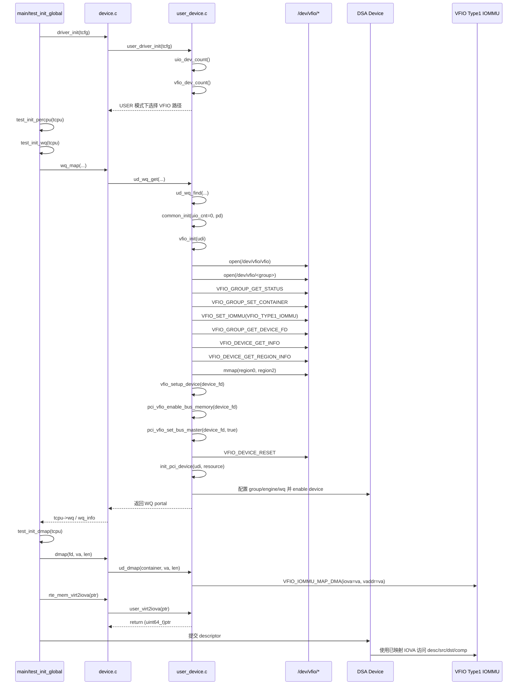

# DSA 使用 VFIO 驱动的调用时序与函数说明

## 1. 总体说明

这个项目里，DSA 走 VFIO 驱动的逻辑主要分成 4 个阶段：

1. 全局驱动选择：判断 USER 模式下到底走 UIO 还是 VFIO
2. 每线程 WQ 初始化：获取用户态 WQ portal，并在首次使用时完成 VFIO 设备接管
3. DMA 映射：把描述符、completion record、buffer 映射到 IOMMU
4. 运行期地址转换：把用户虚拟地址作为 IOVA 提交给 DSA 硬件

关键入口代码：

- 全局驱动分发：[src/device.c](src/device.c#L102)
- VFIO 设备初始化：[src/user_device.c](src/user_device.c#L682)
- VFIO DMA 映射：[src/user_device.c](src/user_device.c#L877)
- VFIO 地址翻译：[src/user_device.c](src/user_device.c#L1359)

## 2. DSA 使用 VFIO 的函数调用时序图

## 3. 主调用链梳理

### 3.1 全局阶段

调用链：

`test_init_global`  
-> `driver_init`  
-> `user_driver_init`

相关代码：

- [src/init.c](src/init.c#L1708)
- [src/device.c](src/device.c#L102)
- [src/user_device.c](src/user_device.c#L1051)

作用：

- 进入 USER 驱动模式
- 统计当前系统绑定到 `uio_pci_generic` 和 `vfio-pci` 的设备数
- 在当前环境中选择 VFIO 路径

### 3.2 每线程 WQ 初始化阶段

调用链：

`test_init_percpu`  
-> `test_init_wq`  
-> `wq_map`  
-> `ud_wq_get`  
-> `ud_wq_find`  
-> `common_init`  
-> `vfio_init`  
-> `vfio_setup_device`  
-> `init_pci_device`  
-> `ud_wq_info_get`

相关代码：

- [src/init.c](src/init.c#L1373)
- [src/init.c](src/init.c#L697)
- [src/device.c](src/device.c#L18)
- [src/user_device.c](src/user_device.c#L1254)
- [src/user_device.c](src/user_device.c#L1184)
- [src/user_device.c](src/user_device.c#L1165)
- [src/user_device.c](src/user_device.c#L682)
- [src/user_device.c](src/user_device.c#L368)
- [src/user_device.c](src/user_device.c#L396)
- [src/user_device.c](src/user_device.c#L1272)

作用：

- 找到一个可用的用户态 WQ
- 如果设备还未初始化，则完成 VFIO 接管和 DSA 硬件配置
- 返回 WQ portal 和配套元信息

### 3.3 DMA 映射阶段

调用链：

`test_init_dmap`  
-> `dmap`  
-> `ud_dmap`

相关代码：

- [src/init.c](src/init.c#L739)
- [src/device.c](src/device.c#L78)
- [src/user_device.c](src/user_device.c#L877)

作用：

- 把 desc、comp、src、dst 对应内存区注册给 VFIO Type1 IOMMU
- 当前工程使用 `iova = va` 的映射方式

### 3.4 地址翻译与运行期阶段

调用链：

`rte_mem_virt2iova`  
-> `user_virt2iova`

相关代码：

- [src/device.c](src/device.c#L115)
- [src/user_device.c](src/user_device.c#L1359)

作用：

- 在 VFIO 路径下，直接把用户虚拟地址作为 IOVA 返回
- 因为前面已经通过 `VFIO_IOMMU_MAP_DMA` 建立了映射，硬件可以直接用这个地址工作

## 4. src/user_device.c 中 VFIO 相关函数逐项说明

下面只梳理 VFIO 相关函数，包含输入、输出和作用。

### 4.1 `vfio_dev_count`

位置：
- [src/user_device.c](src/user_device.c#L950)

输入：
- 无显式参数

输出：
- 返回绑定到 `vfio-pci` 驱动的设备数量

作用：
- 给 `user_driver_init` 判断当前 USER 模式是否应进入 VFIO 路径

### 4.2 `user_driver_init`

位置：
- [src/user_device.c](src/user_device.c#L1051)

输入：
- `struct tcfg *tcfg`

输出：
- `0` 表示成功
- 负值表示失败

作用：
- 统计 UIO/VFIO 设备数
- 禁止 UIO 和 VFIO 混合并存
- 构造用户态设备数组 `udi`
- 读取每个设备的 BDF、NUMA node、device id
- 为后续 `ud_wq_find` 提供候选设备列表

### 4.3 `common_init`

位置：
- [src/user_device.c](src/user_device.c#L1165)

输入：
- `int uio_cnt`
- `struct udev_info *pd`

输出：
- `0` 成功
- 负值失败

作用：
- USER 驱动下的二次分发点
- `uio_cnt == 0` 时调用 `vfio_init`
- 初始化结束后还会调用 `init_tph`

### 4.4 `ud_wq_find`

位置：
- [src/user_device.c](src/user_device.c#L1184)

输入：
- `char *dname`
- `int wq_id`
- `int shared`
- `int numa_node`

输出：
- 返回 `struct ud_wq_info *`
- 找不到可用 WQ 时返回 `NULL`

作用：
- 在候选设备列表中查找可用 WQ
- 首次使用某设备时触发 `common_init -> vfio_init`
- 启用目标 WQ
- 计算并返回对应的 WQ portal 地址

### 4.5 `ud_wq_get`

位置：
- [src/user_device.c](src/user_device.c#L1254)

输入：
- `char *dname`
- `int wq_id`
- `int shared`
- `int numa_node`

输出：
- 返回 WQ portal 指针
- 找不到时返回 `NULL`

作用：
- `ud_wq_find` 的简单包装
- 对外暴露统一接口给 `device.c`

### 4.6 `ud_wq_info_get`

位置：
- [src/user_device.c](src/user_device.c#L1272)

输入：
- `void *ptr`
- `struct wq_info *wq_info`

输出：
- 通过 `wq_info` 回填：
  - WQ size
  - `dmap_fd`
  - 设备名
  - 设备类型

作用：
- 把 VFIO 初始化得到的资源信息提供给上层线程上下文

### 4.7 `pci_vfio_enable_bus_memory`

位置：
- [src/user_device.c](src/user_device.c#L230)

输入：
- `int dev_fd`，VFIO device fd

输出：
- `0` 成功
- `-EIO` 等错误码失败

作用：
- 打开 PCI command register 的 `MEMORY SPACE` 位
- 使设备的 MMIO/BAR 访问处于可用状态

### 4.8 `pci_vfio_set_bus_master`

位置：
- [src/user_device.c](src/user_device.c#L336)

输入：
- `int dev_fd`
- `bool op`

输出：
- `0` 成功
- `-EIO` 等错误码失败

作用：
- 设置或清除 PCI command register 的 `BUS MASTER` 位
- 对 DSA 这类 DMA 设备来说，打开 bus master 是必须的
- 否则设备不能主动读取 descriptor 和访问系统内存

### 4.9 `vfio_setup_device`

位置：
- [src/user_device.c](src/user_device.c#L368)

输入：
- `int vfio_dev_fd`

输出：
- `0` 成功
- 负值失败

作用：
- 调 `pci_vfio_enable_bus_memory`
- 调 `pci_vfio_set_bus_master(..., true)`
- 调 `VFIO_DEVICE_RESET` 尝试复位设备
- 保证设备进入可编程、可 DMA 的初始状态

### 4.10 `vfio_init`

位置：
- [src/user_device.c](src/user_device.c#L682)

输入：
- `struct udev_info *udi`

输出：
- `0` 成功
- 负值失败

作用：
- 完成完整 VFIO 设备接管流程：
  - 打开 `/dev/vfio/vfio`
  - 找到并打开 IOMMU group
  - 检查 group viable
  - group 绑定到 container
  - 设置 `VFIO_TYPE1_IOMMU`
  - 获取 device fd
  - 查询 VFIO region 信息
  - mmap region0/region2
  - 调 `vfio_setup_device`
  - 调 `init_pci_device`
- 保存：
  - `udi->resource[0]`
  - `udi->resource[1]`
  - `udi->dmap_fd = container`

### 4.11 `ud_dmap`

位置：
- [src/user_device.c](src/user_device.c#L877)

输入：
- `int container`
- `void *va`
- `ssize_t len`

输出：
- `0` 成功
- 负值失败

作用：
- 通过 `VFIO_IOMMU_MAP_DMA` 把一段用户地址映射进 IOMMU
- 当前实现中：
  - `dma_map.iova = va`
  - `dma_map.vaddr = va`
- 这样后续 descriptor 里直接写 VA 即可

### 4.12 `ud_dunmap`

位置：
- [src/user_device.c](src/user_device.c#L902)

输入：
- `int container`
- `void *va`
- `ssize_t len`

输出：
- `0` 或 ioctl 返回值
- 出错时返回负 errno

作用：
- 与 `ud_dmap` 配套
- 在测试结束时撤销 IOMMU DMA 映射

### 4.13 `user_virt2iova`

位置：
- [src/user_device.c](src/user_device.c#L1359)

输入：
- `void *p`

输出：
- VFIO 路径下：直接返回 `(uint64_t)p`
- UIO 路径下：返回 `rte_mem_virt2phy(p)`

作用：
- 屏蔽 UIO 与 VFIO 的地址转换差异
- 在 VFIO 模式下，配合 `ud_dmap` 实现 VA 直接作为 IOVA 提交

### 4.14 `ud_iommu_disabled`

位置：
- [src/user_device.c](src/user_device.c#L1365)

输入：
- 无

输出：
- 返回 `!!uio_cnt`

作用：
- 告诉上层当前是不是“按 IOMMU disabled 模型”在运行
- VFIO 路径下这里返回 false
- 会影响运行期 IOTLB 相关分支判断

## 5. 关键设计点总结

### 5.1 为什么 VFIO 路径里 `user_virt2iova` 直接返回 VA

因为在 `ud_dmap` 里，代码明确把：

- `iova = va`
- `vaddr = va`

注册给了 VFIO Type1 IOMMU。

所以 descriptor 中使用的地址不需要再手动翻译成物理地址。

### 5.2 为什么 VFIO 一定要设置 bus master

因为 DSA 是 DMA 设备。它要主动：

- 读取 descriptor
- 读取源数据
- 写目标数据
- 写 completion record

这些都是设备主动发起的 PCIe memory transaction，没有 bus master 权限就不能工作。

### 5.3 `init_pci_device` 为什么也属于 VFIO 调用链的一部分

虽然它本身不是 VFIO API，但它依赖 VFIO 映射出来的 BAR 资源去直接编程 DSA 设备寄存器。

所以从“DSA 通过 VFIO 在 userspace 被接管并配置”的角度看，它是调用链中的关键一环。
